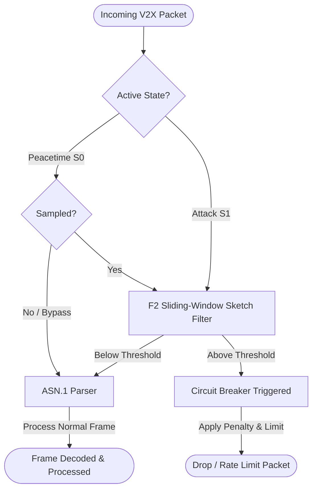
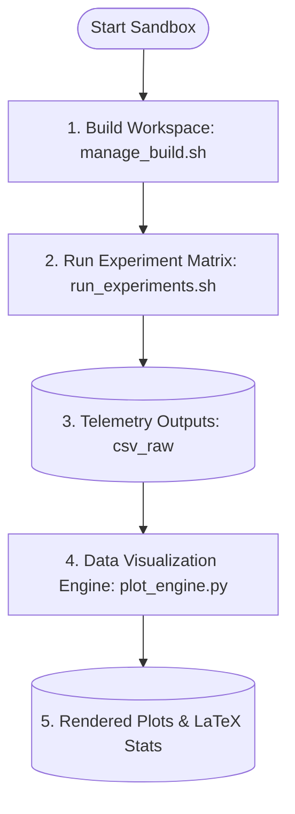

# Characterizing and Mitigating MTU-constrained Parser Workload Amplification in ASN.1-based V2X Stacks

This repository contains the evaluation framework, measurement harness, and dataset core for analyzing and 
mitigating Abstract Syntax Notation One (ASN.1) structural recursion vulnerabilities (CWE-674) under 
strict Maximum Transmission Unit (MTU) barriers in Vehicle-to-Everything (V2X) protocol deployments.

### Open-Source Compliance & Attribution
The V2X protocol simulation and packet processing core in this project is built upon **[Vanetza](https://github.com/riebl/vanetza)**, an open-source implementation of the ETSI C-ITS protocol suite developed by Raphael Riebl and contributors. 

The original Vanetza codebase and the modifications contained in this repository are subject to the **GNU Lesser General Public License (LGPL) v3.0** (with GPL v3.0) as located in the [LICENSE](./LICENSE) file.

---

## 1. Technical Framework Architecture

The framework is structured as a decoupled presentation-layer analytics sandbox integrated directly into 
the open-source ETSI C-ITS protocol suite (Vanetza). It establishes a strict boundary between core 
parsing algorithms, automated matrix evaluation workflows, and the modular analytics suites.

```text
.
├── vanetza_unpatched/        # Baseline workspace vulnerable to CPU workload amplification (CWE-674)
│   └── tools/qos-harness/
│       ├── include/qos_harness/
│       │   ├── pre_filter.hpp  # Discrete state-machine and policy update setters
│       │   └── rl_bridge.hpp   # OOP Telemetry serialization and loopback socket managers
│       └── src/
│           ├── pre_filter.cpp  # Mathematical F2 sliding-window sketch filters
│           └── rl_bridge.cpp   # Standalone IPC handler and blocking handshake controllers
├── vanetza_patched/          # Hardened workspace integrating the adaptive circuit-breaker mitigation
├── inputs/
│   ├── base_packets/         # Legitimate standards-compliant CAM reference base frames
│   └── attack_vectors/
│       └── malware/          # Sandboxed toxic ASN.1 mutation variants and gold-standard POC exploits
├── outputs/
│   ├── csv_raw/
│   │   ├── unpatched/        # Separated data matrices from vulnerable stack execution loops
│   │   └── patched/          # Separated data matrices from protected state-machine loops
│   ├── rl_env/               # Isolated episodic DRL training trajectory traces split by pollution density
│   ├── plots/                # Automated publication-ready figures (Dual-Format: Raster PNG / Vector PDF)
│   │   ├── amplification/    # Absolute parsing latency comparisons and performance gain curves
│   │   └── qos/              # Latency jitter time-series, log-scale CDFs, and resilience timelines
│   └── stats/                # Automated cross-experiment dataframes and LaTeX table source codes
├── manage_build.sh           # Industrial orchestrator for incremental or clean workspace builds
├── run_experiments.sh        # Autonomous evaluation master console for multi-mode batch execution
└── tools/                    # Centralized analytics, automated plotting, and manuscript verification core
    ├── plot_engine.py        # Object-Oriented CLI orchestration entry point for unified plot generation
    ├── engine/               # Encapsulated backend processing modules providing core plotting engines
    └── analysis/             # Independent high-fidelity diagnostic tools and paper verification utilities

```

### 1.1 Mitigation Pre-Filter Pipeline

This diagram shows how incoming network packets are processed by the pre-filter mechanism to mitigate CWE-674 CPU workload amplification:



### 1.2 Evaluation & Visualization Workflow

This diagram outlines the complete end-to-end orchestration pipeline from building to generating plots and tables:



---

## 2. Setup and Automated Build Orchestration

This framework provides two primary orchestration scripts to automate environment configuration, dependency checks, and parallel compilation.

### 2.1 Environmental Setup & Smart Dependency Checking (`setup.sh`)

Before building, use [setup.sh](./setup.sh) to verify systems requirements, configure the Python virtual environment with all required packages, install missing C++ dependencies (Boost, GeographicLib, Crypto++, CMake), download ONNX Runtime C++ prebuilt binaries, and kick off compilation.

```bash
# Verify environment, set up Python venv, and build both patched and unpatched libraries
./setup.sh all

# Build only the unpatched (baseline) workspace (and configure Python environment)
./setup.sh unpatch

# Build only the patched (hardened) workspace (and configure Python environment)
./setup.sh patch

# Only configure/upgrade the Python virtual environment (skip all C++ steps)
./setup.sh python

# Freeze the current active Python virtual environment packages into requirements.txt
./setup.sh freeze
```

### 2.2 Compilation Matrices Orchestration (`manage_build.sh`)

Once dependencies are set up, use [manage_build.sh](./manage_build.sh) for fast incremental compilation or clean builds to bypass legacy caching faults.

```bash
# Execute deep purge of historical cache objects and run a full clean CMake rebuild
./manage_build.sh unpatched clean
./manage_build.sh patched clean

# Execute high-speed parallel incremental compilation via naked make pipelines (2-second hot update)
./manage_build.sh unpatched fast
./manage_build.sh patched fast
```

---

## 3. Runtime Telemetry Console Parameters (`run_experiments.sh`)

The automated harness overrides hardcoded loops, supporting continuous hardware tracking pinned to a stable core.

### Standard Core Routine Invocations

```bash
# Delta Diagnosis: Verify asymmetric CPU expenditure contribution between flood payload maps
./run_experiments.sh unpatched --diagnose-flood

# Geometric Profiling: Sweep and extract packet-size vs CPU amplification factor metrics up to 1400B
./run_experiments.sh unpatched --profile-amp

# Dataset Generation: Run multi-sample strict validation loops to filter high-potency toxic variants
./run_experiments.sh unpatched --build-dataset

# Interactive Training: Launch closed-loop DRL synchronization sandbox on Mode 3 (Forces Socket Handshake)
./run_experiments.sh unpatched --train-rl

```

### Automation Configuration Modifiers

Modifiers can be flexibly placed anywhere within the command-line interface sequence:

* `-c, --core <id>`: Target hardware CPU core index for taskset processor locking (Default: 9)
* `--no-filter-only`: Force `--simulate-all` batch scheduler to execute ONLY Filter=OFF evaluation steps
* `--filter-only`: Force `--simulate-all` batch scheduler to execute ONLY Filter=ON evaluation steps
* `--modes "m1 m2"`: Override default execution matrix with custom target protocol simulation states
* `--rates "r1 r2"`: Override default sweep intervals with a custom whitespace-separated list of pollution floats
* `--disable-safety`: Disable heuristic safety clamping boundaries for the RL agent (allows raw RL outputs)

### Full-Scale Matrix Evaluation Examples

```bash
# Launch default 18-node comparative matrix sweep across modes (0,1,2) and rates (1%,5%,10%)
./run_experiments.sh unpatched --simulate-all

# Launch automated DRL training session sweeping custom pollution boundaries on pinned core indices
./run_experiments.sh unpatched --train-rl --rates "5.0 10.0 20.0" --core 4

# Execute a highly optimized baseline sweep to generate absolute unattacked 0.0% references
./run_experiments.sh all --simulate-all --modes "0" --rates "0.0"

```

### Custom Independent Parameter Injections & Policy Overrides

```bash
# Arguments format: -t [total_frames] -p [pollution_rate] -m [attack_mode] [-f enable_filter] [--recovery r]
./run_experiments.sh unpatched --custom -t 50000 -p 2.5 -m 0
./run_experiments.sh unpatched --custom -t 100000 -p 5.0 -m 1 -f --recovery 0.25 --penalty 35.0 --sq-thresh 550

```

---

## 4. Data Visualization & Advanced Analytics Engine (`tools/`)

The repository integrates an industrial-grade Object-Oriented plotting and verification toolchain to streamline downstream regression analysis and automate publication-quality figure generation. All visualization figures enforce strict IEEE/ACM venue formatting standards (including Times New Roman font faces, inward tick markers, and tight layout packing).

### Unified Plotting Orchestration Core (`plot_engine.py`)

The centralized plotting suite features a deferred lazy-loading architecture to prevent heavy backend library import overhead when querying standard text menus. It manages directories dynamically and saves every generated graphic asset as a high-resolution raster **PNG** alongside a lossless vector **PDF** for LaTeX manuscript insertion. You can trigger it directly via the `python` target:

```bash
# Execute the complete analytical pipeline suite (Generates all dataframes, charts, and tables)
./run_experiments.sh python --plot --all

# Isolate the amplification pipeline to compute regression metrics and refresh the LaTeX tabular code
./run_experiments.sh python --plot --type amp

# Render a pinpoint QoS CDF and Jitter pair targeting distinct pollution rate steps
./run_experiments.sh python --plot --type qos --mode 1 --rate 1.0
./run_experiments.sh python --plot --type qos --mode 1 --rate 5.0
./run_experiments.sh python --plot --type qos --mode 1 --rate 10.0
```

## 5. Distributed Deep Reinforcement Learning Toolchain (`tools/rl_bridge/`)

The framework integrates a decoupled, production-grade Proximal Policy Optimization (PPO) co-simulation engine. The DRL agent dynamically regulates the FSM parameters using a configurable action space. The C++ ONNX Runtime automatically adapts to both **3-Dimensional** or **4-Dimensional Continuous Action Spaces**:

*   **3-Dimensional Action Space (Simplified)**:
    1. **Recovery Rate Expansion Coefficient** ($a_0 \in [0.0, 0.5]$)
    2. **Mitigation Penalty Multiplier** ($a_1 \in [0.0, 100.0]$)
    3. **F2 Sketch Similarity Count Threshold** ($a_2 \in [400, 800]$)
    *(The S0 peacetime sampling rate is dynamically computed in C++: `(1.0 / current_budget) * k`)*
    
*   **4-Dimensional Action Space (Fully Dynamic)**:
    1. **Recovery Rate Expansion Coefficient** ($a_0 \in [0.0, 0.5]$)
    2. **Mitigation Penalty Multiplier** ($a_1 \in [0.0, 100.0]$)
    3. **F2 Sketch Similarity Count Threshold** ($a_2 \in [400, 800]$)
    4. **State S0 Peacetime Active Inspection Sampling Rate** ($a_3 \in [0.0, 1.0]$)

### 5.1 Unified Configuration Subsystem (`config/ppo_agent.yaml`)

To ensure clean algorithmic MLOps decoupling, all environmental boundaries, networking loops, and multi-objective reward shaping weights are isolated into a centralized YAML profile. This allows you to alter the behavior of the network without editing core Python routines.

```yaml
# Target location: tools/rl_bridge/config/ppo_agent.yaml
infrastructure:
  host: "127.0.0.1"
  port: 8080
  checkpoint_dir: "checkpoints"
  online_brain_path: "checkpoints/v2x_online_brain.pth"
  offline_brain_path: "checkpoints/v2x_offline_rmix_e20.pth"

hyperparameters:
  input_dim: 3
  action_dim: 3                         # Supports 3D or 4D control spaces
  lr_online: 0.0003
  batch_size: 32

reward_shaping:
  anomaly_sensitivity_threshold: 0.005  # Lowered to heavily penalize low-density (1%) attacks
  active_attack_weights:
    penalty_scale: 0.5
    sq_thresh_scale: 0.2
    budget_violation_scale: 10.0        # High penalty protects state machine budget collapse
  nominal_traffic_weights:
    recovery_scale: 10.0
    sq_overhead_scale: 0.1
    overhead_penalty_scale: 8.0         # Suppresses CPU consumption spikes during peacetime

```

### 5.2 Closed-Loop Interactive Online Training

This pipeline handles real-time synchronization between the C++ network filter simulation and the PyTorch optimization engine. It utilizes a stochastic Gaussian policy distribution (`dist.sample()`) to actively explore the boundary space.

```bash
# Navigate to the reinforcement learning bridge environment core
cd tools/rl_bridge/

# Step 1: Launch the interactive background optimization server 
python3 scripts/train_online.py

# Step 2: Open a separate terminal and trigger the C++ co-simulation harness
./run_experiments.sh unpatched --train-rl

```

### 5.3 Production Inference Server Deployment (Noise-Free Eval Mode)

Once interactive training converges, exploration noise must be deactivated to maximize defensive stability. The production server loads the trained weights, locks the layers into deterministic execution (`model.eval()`), and maps actions directly to their mathematical mean values (`action_mean`) to crush low-density exploit leakage.

```bash
# Navigate to the reinforcement learning bridge environment core
cd tools/rl_bridge/

# Step 1: Terminate any active training loops and spin up the inference daemon
python3 scripts/serve_agent.py

# Step 2: In a separate terminal, execute the verification sweep on the C++ side
./run_experiments.sh unpatched --train-rl

```

### 5.4 Offline Historical Matrix Batch Optimization

For benchmarking against legacy pipelines or training policies on pre-recorded static datasets without firing up the C++ socket harness, utilize the matrix batch optimization engine. It features $K$-epoch inner-loop updates to ensure PPO advantage convergence.

```bash
# Navigate to the reinforcement learning bridge environment core
cd tools/rl_bridge/

# Run a 20-epoch sweep across mixed dataset trace dumps
python3 scripts/train_offline.py --rate mix --epochs 20

```

### 5.5 Static Policy Verification & Brain Auditing

Use this diagnostic CLI utility to inspect exactly what defensive decisions an exported weights binary (`.pth`) will make when confronted with distinct peacetime vs. high-potency attack vectors.

```bash
# Audit the interactive online brain asset
python3 scripts/verify_brain.py -m checkpoints/v2x_online_brain.pth

# Audit the historical offline matrix brain asset
python3 scripts/verify_brain.py -m checkpoints/v2x_offline_rmix_e20.pth

```

### 5.6 Model Export to ONNX (`--export-onnx`)

Once training completes, serialize the policy weights from PyTorch into an optimized ONNX model. The export pipeline automatically inspects the `.pth` file, dynamically adjusts target layers, and outputs the graph to the root `checkpoints/` folder. It automatically rewrites the model metadata header to set the ONNX IR version to 9 for full backward compatibility with C++ compilers:

```bash
# Export the online brain to ONNX format
./run_experiments.sh python --export-onnx
```

### 5.7 In-Process C++ ONNX Inference (`--onnx`)

During deployment, use the in-process ONNX inference engine to evaluate policy decisions directly in C++ memory without python and socket IPC overhead. Ensure the libraries are fetched and linked during workspace setup:

```bash
# Step 1: Fetch and compile ONNX Runtime C++ dynamic dependencies
bash setup.sh unpatch

# Step 2: Run dynamic in-process ONNX inference simulation (custom example)
./run_experiments.sh unpatched --custom -p 1.0 -m 2 -f --onnx

# Step 3: Run dynamic ONNX inference WITHOUT heuristic safety boundaries (insurance off)
./run_experiments.sh unpatched --custom -p 1.0 -m 2 -f --onnx --disable-safety
```