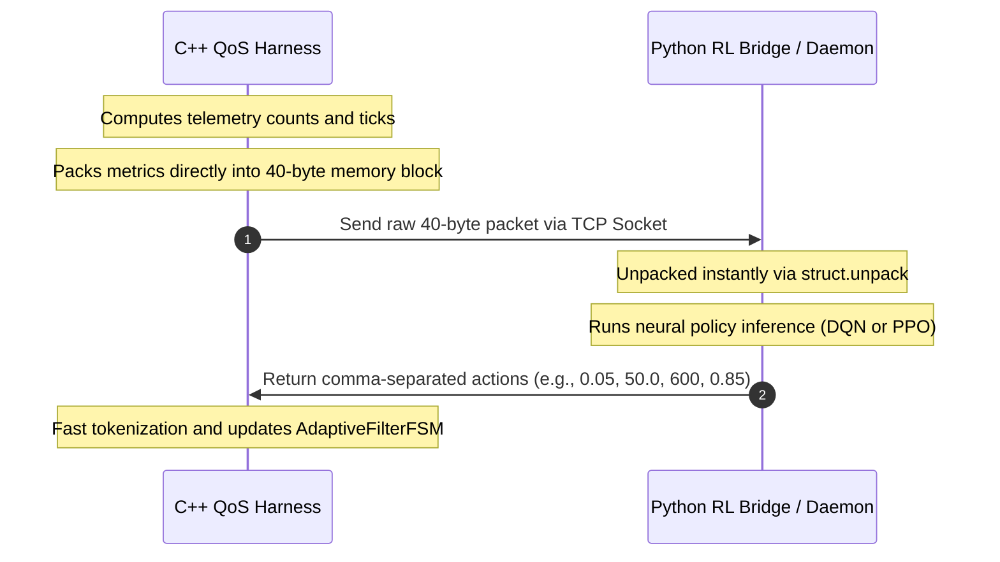

# Characterizing and Mitigating MTU-constrained Parser Workload Amplification in ASN.1-based V2X Stacks

This repository contains the evaluation framework, measurement harness, and dataset core for analyzing and mitigating Abstract Syntax Notation One (ASN.1) structural recursion vulnerabilities (CWE-674) under strict Maximum Transmission Unit (MTU) barriers in Vehicle-to-Everything (V2X) protocol deployments.

### Open-Source Compliance and Attribution

The V2X protocol simulation and packet processing core in this project is built upon **[Vanetza](https://github.com/riebl/vanetza)**, an open-source implementation of the ETSI C-ITS protocol suite developed by Raphael Riebl and contributors. 

The original Vanetza codebase and the modifications contained in this repository are subject to the **GNU Lesser General Public License (LGPL) v3.0** (with GPL v3.0) as located in the [LICENSE](./LICENSE) file.

---

## 1. Technical Framework Architecture

The framework is structured as a decoupled presentation-layer analytics sandbox integrated directly into the open-source ETSI C-ITS protocol suite (Vanetza). It establishes a strict boundary between core parsing algorithms, automated matrix evaluation workflows, and the modular analytics suites.

```text
.
├── vanetza_unpatched/      # Baseline workspace vulnerable to workload amplification (CWE-674)
│   └── tools/qos-harness/  # C++ Evaluation Kernel [See sub-README in directory]
├── vanetza_patched/        # Hardened workspace integrating the adaptive FSM pre-filter
├── inputs/                 # Nominal V2X reference packets and mutated attack vectors [See sub-README]
├── outputs/                # Raw telemetry CSV matrices, LaTeX stats, and publication-ready plots
├── docker/                 # Containerized sandbox environment [See sub-README]
├── tools/
│   ├── plot_engine.py      # Publication-grade plotting engine (renders PNG/PDF figures and tables)
│   └── rl_bridge/          # Python DRL Framework (DQN / PPO)
│       ├── config/         # Centralized YAML agent profiles (agent.yaml)
│       ├── scripts/        # Python entry points for training, live serving, and ONNX exporting
│       ├── src/            # Core PyTorch neural structures, Gym environments, and translators
│       └── tests/          # Pytest regression validation suite
├── manage_build.sh         # C++ Incremental build and harness synchronization tool
├── run_experiments.sh      # Batch simulation execution and training orchestrator
├── setup.sh                # Environment validator and dependency installation script
├── .gitignore              # Project-wide Git exclusion rules and data whitelists
└── LICENSE                 # Open-source compliance terms (LGPL v3.0)
```

### 1.1 Mitigation Pre-Filter Pipeline

This diagram shows how incoming network packets are processed by the pre-filter mechanism to mitigate CWE-674 CPU workload amplification:


### 1.2 Low-Overhead IPC Protocol

To eliminate latency and overhead during co-simulation, we implemented a Zero-Allocation Binary Struct Wire Protocol. The C++ kernel packs metrics into a 40-byte fixed-size struct, preventing text serialization and memory allocation bottlenecks:



---

## 2. Setup and Automated Build Orchestration

This framework provides shell scripts to automate environment configuration, dependency checks, and parallel compilation.

### 2.1 Environmental Setup and Dependency Checking (setup.sh)

Before building, use setup.sh to verify system requirements, configure the Python virtual environment with required packages, install missing C++ dependencies (Boost, GeographicLib, Crypto++, CMake), download ONNX Runtime C++ prebuilt binaries, and start compilation.

```bash
# Verify environment, set up Python venv, and build both patched and unpatched libraries
bash setup.sh all

# Build only the unpatched (baseline) workspace (and configure Python environment)
bash setup.sh unpatch

# Build only the patched (hardened) workspace (and configure Python environment)
bash setup.sh patch

# Only configure the Python virtual environment (skip all C++ steps)
bash setup.sh python

# Freeze the current active Python virtual environment packages into requirements.txt
bash setup.sh freeze
```

### 2.2 Compilation Matrices and Harness Synchronization (manage_build.sh)

Use manage_build.sh for fast incremental compilation, clean builds, or synchronizing the DRL harness between workspaces.

```bash
# Execute deep purge of historical cache objects and run a full clean CMake rebuild
bash manage_build.sh unpatched clean
bash manage_build.sh patched clean

# Execute parallel incremental compilation via make (fast hot update)
bash manage_build.sh unpatched fast
bash manage_build.sh patched fast

# Synchronize unpatched harness modifications into the patched workspace (unpatched -> patched)
bash manage_build.sh --sync-harness

# Force reverse synchronization (Danger: overwrites unpatched harness with patched code)
bash manage_build.sh --sync-harness --reverse
```

---

## 3. Runtime Telemetry Console Parameters (run_experiments.sh)

The automated harness overrides hardcoded loops, supporting continuous hardware tracking pinned to a stable core.

### Standard Core Routine Invocations

```bash
# Delta Diagnosis: Verify CPU expenditure contribution between flood payload maps
bash run_experiments.sh unpatched --diagnose-flood

# Geometric Profiling: Sweep and extract packet-size vs CPU amplification factor metrics
bash run_experiments.sh unpatched --profile-amp

# Dataset Generation: Run validation loops to filter high-potency toxic variants
bash run_experiments.sh unpatched --build-dataset

# Interactive Training: Launch closed-loop DRL training (forces Socket Handshake)
bash run_experiments.sh unpatched --train-rl
```

> [!TIP]
> **Python Action Parameters**: You can append `-h` or `--help` directly to any python action command (e.g. `bash run_experiments.sh python --train-online -h` or `bash run_experiments.sh python --verify-brain -h`) to view all script-specific arguments (such as `-p` for port, `-b` for batch size, `-e` for training epochs, or `-lr` for learning rate).

### Automation Configuration Modifiers

Modifiers can be placed anywhere within the command-line interface sequence:

* `-c, --core <id>`: Target hardware CPU core index for taskset processor locking (Default: 9)
* `-n, --no-taskset`: Disable CPU core pinning (allows dynamic OS scheduling; recommended for RL)
* `-B, --baseline-only`: Execute ONLY Filter=OFF simulation steps (No mitigation)
* `-F, --filter-only`: Execute ONLY Filter=ON simulation steps (Mitigation active)
* `-m, --modes "m1 m2"`: Override default simulation scenario modes (Default: "0 1 2"):
    * `0` = Uniform Random Attack (Malware dispersed randomly)
    * `1` = Single Pulse Attack (Sudden burst at 30%-50% window)
    * `2` = Periodic On-Off (5 waves of peak attack cycles)
    * `3` = Grand Mix Scenario (Dynamic hybrid mix for RL training)
* `-r, --rates "r1 r2"`: Override default sweep pollution density rates (e.g. `1.0 5.0 10.0` or `mix`)
    * `mix` blends historical trajectories of multiple intensities for offline training.
* `-o, --onnx [path]`: Enable in-process ONNX model inference during simulation
* `-s, --disable-safety`: Disable heuristic safety clamping boundaries for the RL agent (allows raw RL outputs)

### Full-Scale Matrix Evaluation Examples

```bash
# Launch default comparative matrix sweep across modes and rates
bash run_experiments.sh unpatched --simulate-all

# Launch automated DRL training session sweeping custom pollution boundaries without core pinning
bash run_experiments.sh unpatched --train-rl -r "5.0 10.0 20.0" -n

# Execute a baseline sweep to generate absolute unattacked references
bash run_experiments.sh all --simulate-all -m "0" -r "0.0"

# Run in-process ONNX inference simulation sweep without core locking
bash run_experiments.sh unpatched --simulate-all -o -n -F
```

---

## 4. Data Visualization Engine (tools/)

The repository integrates an Object-Oriented plotting and verification toolchain to streamline downstream regression analysis and automate publication-quality figure generation. All visualization figures enforce strict IEEE/ACM venue formatting standards (including Times New Roman font faces, inward tick markers, and tight layout packing).

Unified plotting orchestration can be triggered directly via the `python` target:

```bash
# Execute the complete analytical pipeline suite (Generates all dataframes, charts, and tables)
bash run_experiments.sh python --plot --all

# Isolate the amplification pipeline to compute regression metrics and refresh the LaTeX tabular code
bash run_experiments.sh python --plot --type amp

# Render a pinpoint QoS CDF and Jitter pair targeting distinct pollution rate steps
bash run_experiments.sh python --plot --type qos --mode 1 --rate 1.0
bash run_experiments.sh python --plot --type qos --mode 1 --rate 5.0
bash run_experiments.sh python --plot --type qos --mode 1 --rate 10.0
```

---

## 5. Distributed Deep Reinforcement Learning Toolchain (tools/rl_bridge/)

The framework integrates a decoupled, production-grade Deep Reinforcement Learning co-simulation engine supporting both DQN and PPO algorithms.

### 5.1 Unified Configuration Subsystem (config/agent.yaml)

To ensure clean algorithmic MLOps decoupling, all environmental boundaries, networking loops, and multi-objective reward shaping weights are isolated into a centralized YAML profile (`config/agent.yaml`). This allows you to alter the behavior of the network without editing core Python routines.

The framework supports dynamically scaling PyTorch network input (`state_dim`) and output (`action_dim`) layers at startup:
* **State Dimension Auto-scaling**: Adjusting the `active_features` list in `online_socket_env.py` automatically scales the network's input layers.
* **Action Dimension Auto-scaling**: Adding or removing discrete actions in the `action_map` inside `agent.yaml` automatically scales the DQN network's output layers.

```yaml
# Target location: tools/rl_bridge/config/agent.yaml
algorithm: "dqn"                         # Selected active algorithm ("dqn" or "ppo")

infrastructure:
  host: "127.0.0.1"
  port: 8080
  checkpoint_dir: "checkpoints"
  online_brain_path: "checkpoints/v2x_online_brain.pth"
  offline_brain_path: "checkpoints/v2x_offline_rmix_e20.pth"

hyperparameters:
  lr_online: 0.0003
  lr_offline: 0.0005
  batch_size: 32

reward_shaping:
  anomaly_sensitivity_threshold: 0.005  # Lowered to heavily penalize low-density (1%) attacks
  penalty_scale: 10.0                   # Safety penalty weight mapping (high = strict blocking)
  overhead_scale: 2.0                   # Resource cost weight mapping (high = low CPU overhead)
```

### 5.2 Closed-Loop Interactive Online Training

This pipeline handles real-time synchronization between the C++ network filter simulation and the PyTorch optimization engine:

```bash
# Step 1: Launch the interactive training server (Terminal 1)
bash run_experiments.sh python --train-online -a dqn

# Step 2: Open a separate terminal and trigger the C++ co-simulation harness (Terminal 2)
bash run_experiments.sh unpatched --train-rl
```

### 5.3 Production Inference Server Deployment (Noise-Free Eval Mode)

Once interactive training converges, exploration noise is deactivated. The production serve daemon loads the trained weights, locks the layers into deterministic execution (`model.eval()`), and maps actions directly to their mathematical mean or Q-argmax values:

```bash
# Step 1: Spin up the inference daemon (Terminal 1)
bash run_experiments.sh python --deploy -a dqn

# Step 2: In a separate terminal, execute the verification sweep on the C++ side (Terminal 2)
bash run_experiments.sh unpatched --simulate-all -F -r "10.0 5.0 1.0"
```

### 5.4 Offline Historical Matrix Batch Optimization

For benchmarking against legacy pipelines or training policies on pre-recorded static datasets without firing up the C++ socket harness, utilize the matrix batch optimization engine:

```bash
# Run a 20-epoch sweep across mixed dataset trace dumps using short flags
bash run_experiments.sh python --train-offline -r mix -e 20
```

### 5.5 Static Policy Verification and Brain Auditing

Use this diagnostic CLI utility to inspect exactly what defensive decisions an exported weights binary (`.pth`) will make when confronted with distinct peacetime vs. high-potency attack vectors:

```bash
# Audit the interactive online brain asset
bash run_experiments.sh python --verify-brain -m checkpoints/v2x_online_brain_dqn.pth
```

### 5.6 Model Export to ONNX

Once training completes, serialize the policy weights from PyTorch into an optimized ONNX model. The export pipeline automatically inspects the `.pth` file, dynamically wraps the DQN action translator graph inside the exported network to align math inputs/outputs, and writes the output `.onnx` to the root `checkpoints/` folder:

```bash
# Export the online brain to ONNX format
bash run_experiments.sh python --export-onnx -m checkpoints/v2x_online_brain_dqn.pth
```

### 5.7 In-Process C++ ONNX Inference

During deployment, use the in-process ONNX inference engine to evaluate policy decisions directly in C++ memory without Python and socket IPC overhead:

```bash
# Run dynamic in-process ONNX inference simulation sweep (custom example)
bash run_experiments.sh unpatched --simulate-all -F -r "10.0 5.0 1.0" -o v2x_agent_dqn.onnx
```