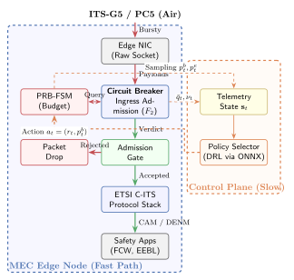

# ADAM: Availability-Preserving Admission Control for V2X Edge Systems

ADAM is a reproducible evaluation framework for studying ASN.1 parser workload
amplification (CWE-674) and computation-aware packet admission on
resource-constrained V2X edge nodes. It combines a bounded-cost F2 structural
filter, a safety-authoritative finite-state machine (FSM), and an asynchronous
DQN policy selector.

The publication model is the v7 five-action raw-Q DQN exported to ONNX. The
latency-critical packet path does not run Python: ONNX inference runs
asynchronously in the C++ receiver, while the FSM retains authority over
safety-critical sampling overrides.

## Repository scope

This repository vendors two Vanetza workspaces with different experimental
roles:

- `vanetza_unpatched/` is the primary paper-evaluation workspace. It contains
  the vulnerable parser used to measure workload amplification and the ADAM
  admission-control harness placed before that parser.
- `vanetza_patched/` contains a recursion-depth-limited Vanetza revision. It is
  retained only as a parser-hardening reference implementation. It is not the
  proposed ADAM mechanism and is not used for the paper's principal reported
  results.

The Vanetza packet-processing code remains subject to its upstream LGPL/GPL
licensing terms; see [LICENSE](LICENSE) and the licenses inside each vendored
workspace.

```text
.
├── checkpoints/                 # Publication ONNX model and local training artifacts
├── inputs/                      # Nominal packets and generated attack vectors
├── outputs/                     # Experiment telemetry, aggregated statistics, and plots
├── tools/
│   ├── plot_engine.py           # Single-run and multi-run analysis
│   ├── sender/udp_sender.py     # Physical-testbed Python UDP traffic sender
│   └── rl_bridge/               # Online training, model export, and verification
├── vanetza_unpatched/           # Primary ADAM evaluation workspace
├── vanetza_patched/             # Recursion-limit comparison workspace
├── manage_build.sh              # C++ build helper
├── run_experiments.sh           # Simulation/training command router
├── run_tests.sh                 # C++ control-logic unit tests
└── setup.sh                     # Dependency and environment setup
```

## Architecture



The figure is generated from the paper's TikZ architecture source in
[`docs/paper_architecture.tex`](docs/paper_architecture.tex). Regenerate it
with:

```bash
pdflatex -interaction=nonstopmode -halt-on-error \
  -output-directory=/tmp docs/paper_architecture.tex
pdf2svg /tmp/paper_architecture.pdf docs/architecture.svg
```

The controller observes four consecutive 100-packet telemetry windows. Each
window contains seven normalized features, producing the publication model's
28-element input. The model returns five Q-values corresponding to five bounded
`[recovery rate, S0 sampling rate]` profiles. The FSM may override the selected
profile and enforces mandatory inspection in its constrained/depleted states.

## Publication model

The default deployment path is configured in
`tools/rl_bridge/config/agent.yaml`:

```text
checkpoints/v2x_agent_dqn_cmdp_v7_profiles_raw_q.onnx
checkpoints/v2x_agent_dqn_cmdp_v7_profiles_raw_q.onnx.data
```

Both files are required because the ONNX graph uses external weight data. The
model accepts `[batch_size, 28]` telemetry and returns `[batch_size, 5]` raw
Q-values.

## Setup and build

On Ubuntu/Debian, the setup helper validates native dependencies, creates the
Python virtual environment, installs Python requirements, and configures ONNX
Runtime:

```bash
bash setup.sh unpatch   # primary paper-evaluation workspace
bash setup.sh patch     # recursion-limit comparison workspace
bash setup.sh all       # both workspaces
bash setup.sh python    # Python environment only
```

For subsequent C++ builds:

```bash
bash manage_build.sh unpatched fast
bash manage_build.sh unpatched clean
bash manage_build.sh patched fast
```

The `unpatched`/`patched` labels describe the underlying parser revision, not
whether the ADAM pre-filter is enabled. Filter selection is a runtime option.

## Quick local evaluation

Run the publication model against the unpatched parser workspace:

```bash
bash run_experiments.sh unpatched --simulate-all \
  -F -o -m "0 1 2" -r "1.0 5.0 10.0" -N 1000000 -l 3000
```

With `-o` and no explicit filename, the C++ harness loads the v7 path from
`agent.yaml`. Useful comparison modes are:

```bash
# Native vulnerable parser, admission filter disabled
bash run_experiments.sh unpatched --simulate-all -B -m "0" -r "10.0"

# FSM-only admission control
bash run_experiments.sh unpatched --simulate-all -F -m "0" -r "10.0"

# Static 100% inspection
bash run_experiments.sh unpatched --simulate-all -F -S -m "0" -r "10.0"

# v7 DQN + FSM admission control
bash run_experiments.sh unpatched --simulate-all -F -o -m "0" -r "10.0"
```

Attack modes are:

- `0`: continuous uniformly distributed attack samples
- `1`: a single pulse between 30% and 50% of the packet sequence
- `2`: periodic on/off attack windows
- `3`: mixed transition-heavy training scenario

## Online training and ONNX export

The publication policy was produced by online training with the C++ harness;
offline training is not the paper's model-training path.

Start the Python online learner:

```bash
bash run_experiments.sh python --train-online \
  --algorithm dqn \
  --checkpoint-path checkpoints/v2x_online_brain_dqn_cmdp_v7_profiles.pth
```

In a second terminal, stream online training trajectories from the C++ harness.
For example, the following pairs the three modes and rates by index:

```bash
bash run_experiments.sh unpatched --train-rl \
  --zip -m "0 1 2" -r "1.0 5.0 10.0" \
  -N 1000000 -l 3000
```

For a longer curriculum, pass `--sequence-file <file>`; relative filenames are
resolved from `tools/trainingConfigs/`. Without `--zip` or a sequence file,
`--train-rl` executes the full modes-by-rates matrix.

Export and verify a trained checkpoint:

```bash
bash run_experiments.sh python --export-onnx \
  -m checkpoints/v2x_online_brain_dqn_cmdp_v7_profiles.pth \
  --raw-dqn \
  -o checkpoints/v2x_agent_dqn_cmdp_v7_profiles_raw_q.onnx

bash run_experiments.sh python --verify-onnx \
  -o checkpoints/v2x_agent_dqn_cmdp_v7_profiles_raw_q.onnx
```

## Physical Raspberry Pi evaluation

The paper's physical transport path uses the C++ UDP receiver on the edge node
and `tools/sender/udp_sender.py` on the traffic-generator host. The Python
sender controls the workload schedule; it does not perform policy inference.

On the Raspberry Pi:

```bash
bash manage_build.sh unpatched fast
bash run_experiments.sh unpatched receive -P 9999 -o \
  --data-core 2 --control-core 3
```

On the traffic-generator host:

```bash
python tools/sender/udp_sender.py \
  --dest-ip <RASPBERRY_PI_IP> -P 9999 \
  -m "0 1 2" -r "0.1 0.5 1.0 5.0 10.0" \
  -N 1000000 -l 3000 -o -I "1 20"
```

`-I "1 20"` creates 20 independent trial directories under
`outputs/multi_runs/`. Run the sender separately with `-B`, `-C`, `-F`, `-S`,
and `-o` to collect native, CoDel, FSM-only, static-inspection, and DQN/FSM
comparison profiles. Use `--dry-run` to inspect a session matrix without
sending packets.

## Plotting and paper statistics

The publication tables and timelines use the multi-run pipeline:

```bash
python tools/plot_engine.py -M --runs 1-20
```

It reads `outputs/multi_runs/`, computes trial-level aggregated statistics,
selects representative median runs for timeline figures, and writes results to:

```text
outputs/stats_multi_runs/
outputs/plots_multi_runs/
```

For local single-run diagnostics:

```bash
bash run_experiments.sh python --plot --type qos --onnx --mode 0 --rate 10.0
bash run_experiments.sh python --plot --type timeline --onnx
bash run_experiments.sh python --plot --type pareto
```

## Tests

Run the dependency-free C++ control-logic tests:

```bash
bash run_tests.sh
```

They cover telemetry normalization, policy safety boundaries, DQN/PPO action
routing compatibility, FSM budget-state boundaries, and the F2 filter.

Run Python consistency tests with:

```bash
bash run_experiments.sh python --test
```

## Data and reproducibility notes

- Aggregate arrival rate defaults to 3000 packets/s; paper runs use one million
  packets per session unless explicitly stated otherwise.
- Raw hardware measurements depend on CPU affinity, architecture, OS scheduling,
  and network conditions. Record those values when producing new results.
- V2AIX-derived source data is not redistributed where its license prohibits
  redistribution. See [inputs/README.md](inputs/README.md) for preparation and
  provenance information.
- Most generated telemetry and local training checkpoints are not part of the
  publication tree. The publication ONNX pair is retained so the evaluated
  controller can be executed directly.

## Command reference

```bash
bash setup.sh --help
bash manage_build.sh --help
bash run_experiments.sh --help
python tools/sender/udp_sender.py --help
python tools/plot_engine.py --help
```
