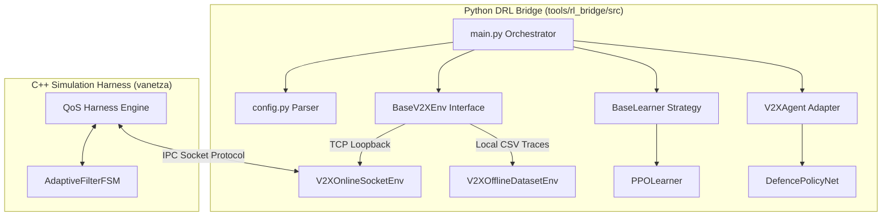
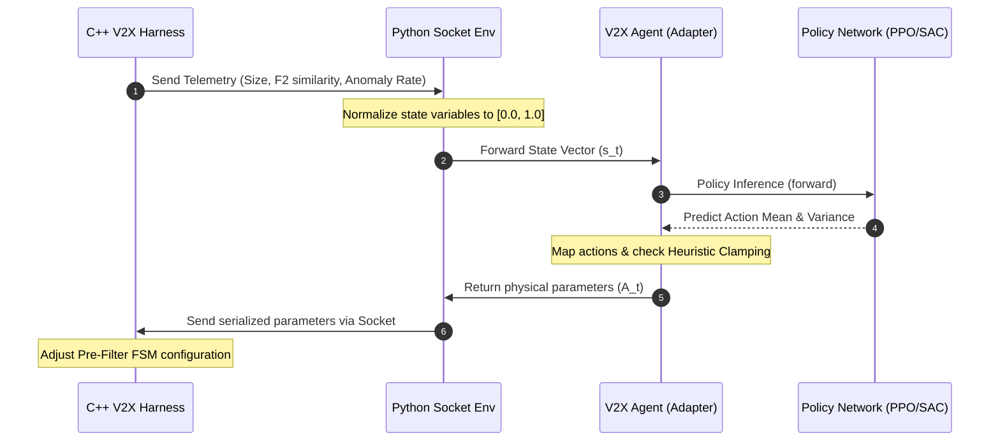
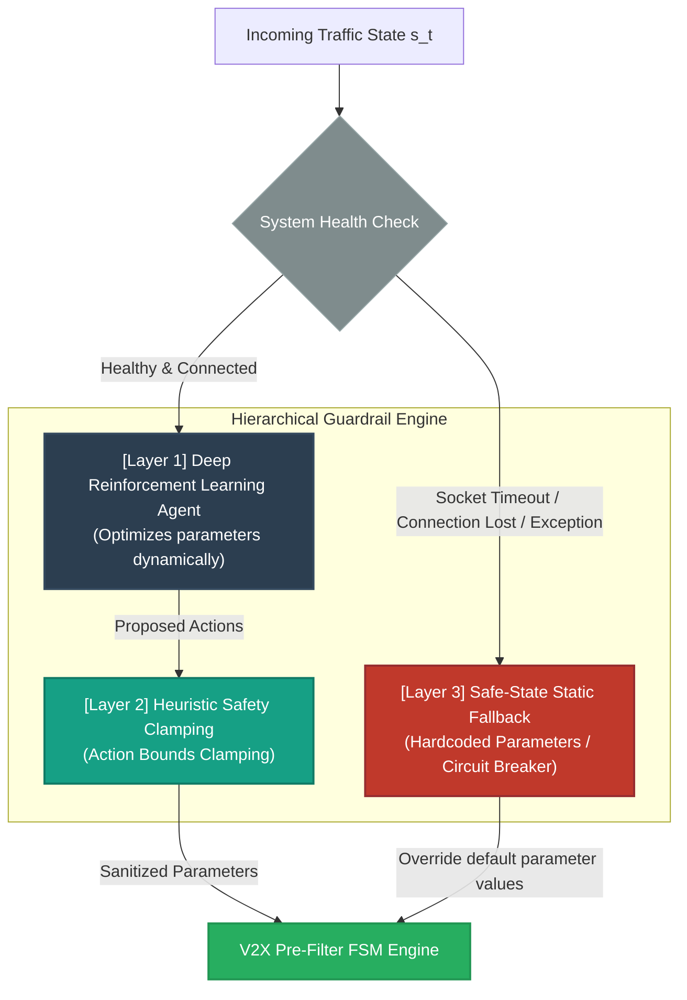

# V2X QoS Mitigation Framework: Refactoring, Heuristics, & DRL-Enabled Optimization
## Group Meeting Progress Report (Developer Reference & Slide Content)

---

## Slide 1: Executive Summary & Project Milestones
* **Core Objective:** Protect vehicle-to-everything (V2X) protocol stacks (built on [Vanetza](file:///wsl.localhost/V2X/home/yhl/term-project/CSE625_QoS/vanetza_unpatched)) from CWE-674 structural workload amplification vulnerability (ASN.1 recursion bombs) that leads to CPU resource exhaustion.
* **Key Achievements:**
  * **Industrial Refactoring:** Transformed academic research code into an enterprise-ready, modular, and type-safe Python package with strict Separation of Concerns (SoC).
  * **Adaptive Heuristic Pre-Filtering:** Developed an $O(W)$ sliding-window F2 sketch pre-filter Finite State Machine (FSM) integrated directly into the C++ traffic harness to drop toxic payloads early.
  * **Closed-Loop DRL Bridge:** Integrated a Deep Reinforcement Learning (DRL) optimization layer (supporting PPO and SAC) using socket-based co-simulation to adaptively tune filter parameters in real-time.
  * **Hierarchical Performance Guardrails:** Formulated a 3-tier defense loop (DRL $\rightarrow$ Heuristic Clamping $\rightarrow$ Hardcoded Defaults) that guarantees system stability and protects the performance lower bound under all conditions.

---

## Slide 2: Industrial-Grade Software Architecture Refactoring
* **Architectural Transition:** Migrated from monolithic spaghetti scripts to a clean, decoupled Python framework matching industry MLOps standards.
* **Design Patterns & SOLID Compliance:**
  * **Orchestrator Pattern ([main.py](file:///wsl.localhost/V2X/home/yhl/term-project/CSE625_QoS/tools/rl_bridge/src/main.py)):** Standardizes setup pipelines, switches training modes, and instantiates components via centralized configuration parsing.
  * **Strategy Pattern ([base_learner.py](file:///wsl.localhost/V2X/home/yhl/term-project/CSE625_QoS/tools/rl_bridge/src/algorithms/base_learner.py)):** Defines interchangeable training algorithms, enabling seamless switching between [PPOLearner](file:///wsl.localhost/V2X/home/yhl/term-project/CSE625_QoS/tools/rl_bridge/src/algorithms/ppo_learner.py) and SAC models.
  * **Adapter Pattern ([v2x_agent.py](file:///wsl.localhost/V2X/home/yhl/term-project/CSE625_QoS/tools/rl_bridge/src/agents/v2x_agent.py)):** Encapsulates the `ActionAdapter` mapping mathematical network predictions to valid physical parameter inputs of the C++ simulation.
  * **Clean Isolation:** Abstracted environment interfaces ([base_env.py](file:///wsl.localhost/V2X/home/yhl/term-project/CSE625_QoS/tools/rl_bridge/src/envs/base_env.py)) to handle live sockets ([online_socket_env.py](file:///wsl.localhost/V2X/home/yhl/term-project/CSE625_QoS/tools/rl_bridge/src/envs/online_socket_env.py)) and local datasets ([offline_dataset_env.py](file:///wsl.localhost/V2X/home/yhl/term-project/CSE625_QoS/tools/rl_bridge/src/envs/offline_dataset_env.py)) uniformly.



---

## Slide 3: Heuristic Layer - Adaptive Pre-Filter FSM
* **State Transition Logic:** 
  The FSM maps a virtual CPU budget $B_t \in [0.0, 100.0]$ to four threat states partitioned by threshold constants:
  - $\text{State} = S_0 \text{ (Normal)}$ if $B_t > 70.0\ (\tau_1)$
  - $\text{State} = S_1 \text{ (Elevated)}$ if $40.0 < B_t \le 70.0\ (\tau_2)$
  - $\text{State} = S_2 \text{ (Constrained)}$ if $10.0 < B_t \le 40.0\ (\tau_3)$
  - $\text{State} = S_3 \text{ (Quarantine)}$ if $B_t \le 10.0$
* **Dynamic Sampling Rate Interpolation:**
  To minimize CPU overhead during peacetime while ensuring detection coverage during attacks, the inspection sampling rate $P_{\text{inspect}}$ is dynamically interpolated:
  - If $B_t \le 40.0$: $P_{\text{inspect}} = 1.0$ (100% inspection)
  - If $40.0 < B_t \le 70.0$: Linear scaling between 50% and 100%:
    $$P_{\text{inspect}} = 1.0 - 0.5 \cdot \left(\frac{B_t - 40.0}{30.0}\right)$$
  - If $70.0 < B_t < 100.0$: Linear scaling between base sampling rate ($P_{\text{base}}$) and 50%:
    $$P_{\text{inspect}} = 0.5 - (0.5 - P_{\text{base}}) \cdot \left(\frac{B_t - 70.0}{30.0}\right)$$
  - High-performance, zero-overhead stochastic gating is executed via `(fast_rand() % 100) < (P_inspect * 100.0)` utilizing a custom Xorshift32 PRNG.

* **Heuristic Budget Modification Rules:**
  - **Attack Penalty:** If a packet is flagged as anomalous, the budget is depleted:
    $$B_{t+1} = \max\left(0.0,\ B_t - \left(\frac{\text{sum\_sq} - \text{threshold}}{\text{threshold}}\right) \cdot \mu_{\text{penalty}} \cdot 10.0\right)$$
  - **Streak-Based Recovery Acceleration:** If no anomaly is detected:
    - Increments `clean_streak`.
    - If `clean_streak` > 1000, apply 6.0x accelerated recovery: $B_{t+1} = \min(100.0,\ B_t + 6.0 \cdot \gamma_{\text{recovery}})$
    - Else, apply nominal recovery: $B_{t+1} = \min(100.0,\ B_t + \gamma_{\text{recovery}})$

---

## Slide 4: Sliding Window F2 Sketch Algorithm Details
* **F2 Sketch Formulation:**
  The second frequency moment (F2) represents the sum of squares of byte frequencies in a sliding window $W$:
  $$\text{sum\_sq} = \sum_{v \in \Sigma} (f_v)^2$$
  where $f_v$ is the frequency of byte value $v$ inside sliding window size $W = 64$.
* **Algorithm Steps & Complexity Capping ([pre_filter.cpp](file:///wsl.localhost/V2X/home/yhl/term-project/CSE625_QoS/vanetza_unpatched/tools/qos-harness/src/pre_filter.cpp)):**
  1. **Scan Limit Restriction:** Capping search limits to the first 80 bytes ($W + 16$) of the packet buffer to capture exploit signatures at the onset while maintaining $O(1)$ operations per packet.
  2. **Histogram & Window Shift:** Shifting the sliding window. Evicting the oldest byte value ($old$) decrements its histogram count $f_{old}$. Injecting the new byte value ($new$) increments its histogram count $f_{new}$.
  3. **Early-Exit Short-Circuit:** During the sum-of-squares calculation, if the partial sum exceeds $\text{sq\_threshold}$, the calculation halts and returns `sum_sq` immediately. This halts execution inside the inspection phase to mitigate the filter's own workload overhead.

---

## Slide 5: Deep Reinforcement Learning (DRL) Integration
* **Co-Simulation Bridge Infrastructure:**
  * Synchronous communication between the C++ V2X simulation harness and PyTorch neural networks via TCP loopback sockets (port 8080).
* **Markov Decision Process (MDP) Modeling:**
  * **State Space ($s_t \in \mathbb{R}^3$):**
    $$s_t = \begin{bmatrix} \text{Normalized Packet Size} \\ \text{Normalized F2 Sketch Similarity} \\ \text{Pollution/Anomaly Rate} \end{bmatrix}$$
  * **Action Space ($a_t \in \mathbb{R}^2$ or $\mathbb{R}^4$ under control):**
    * Network output continuous actions are dynamically mapped to physical parameters inside `V2XAgent.map_actions_to_environment()`:
      $$A_i = \text{clamp}\left( A_{\text{min}, i} + \text{sigmoid}(a_{t, i}) \cdot (A_{\text{max}, i} - A_{\text{min}, i}), \ A_{\text{min}, i}, \ A_{\text{max}, i} \right)$$
    * Managed Parameters: `recovery_rate` (budget recovery speed) and `penalty_multiplier` (budget drain rate under attack).



---

## Slide 6: Multi-Objective Reward Shaping Design
* **Phase-Aware Reward Switching:** The reward function dynamically modifies its optimization goals depending on the observed threat index (using threshold $\theta = 0.005$):
* **Attack Phase ($o_{\text{anomaly}} \ge \theta$):** Prioritizes protocol stack survival and prevents CPU budget depletion.
  $$R_{\text{attack}} = w_{\text{penalty}} \cdot a_{\text{penalty\_multiplier}} + w_{\text{sq}} \cdot \left( \frac{600 - a_{\text{sq\_threshold}}}{600} \right) - w_{\text{budget}} \cdot \left(1.0 - \frac{V_{\text{budget}}}{100.0}\right)$$
* **Peacetime Phase ($o_{\text{anomaly}} < \theta$):** Prioritizes throughput and minimizes inspection latency overhead.
  $$R_{\text{nominal}} = w_{\text{recovery}} \cdot a_{\text{recovery\_rate}} + w_{\text{sq\_overhead}} \cdot (a_{\text{sq\_threshold}} - 600) - w_{\text{overhead}} \cdot a_{\text{base\_sampling\_rate}}$$

---

## Slide 7: Hierarchical Guardrails - Performance Lower-Bound Protection
* **Problem Statement:** Pure RL controllers are susceptible to out-of-distribution (OOD) data, cold starts, and reward hacking, which can cause policy divergence and compromise network safety.
* **Hierarchical Safeguards:**
  1. **Layer 1: DRL Policy Network (Optimization Layer):** Continuously adapts parameters to balance latency, CPU load, and filtering performance based on dynamic traffic profiles.
  2. **Layer 2: Heuristic Controller (Safety Clamping Layer):** Intercepts and clamps RL output values to a safe physical window via `enforce_safety_heuristics()`. Prevents hazardous policy updates (e.g., setting the penalty multiplier to 0 or recovery rate too high).
  3. **Layer 3: Safe-State Default Fallback (Ultimate Resilience Layer):** The final safety net. In case of network connection drops, socket timeouts, or internal exceptions, the system bypasses the active DRL-Heuristic pipeline entirely and loads hardcoded defaults (`sq_threshold = 600.0`, `base_sampling_rate = 0.10`), guaranteeing a solid performance lower bound.



---

## Slide 8: Production Verification & MLOps Pipelines
* **Integrated CLI Console ([run_experiments.sh](file:///wsl.localhost/V2X/home/yhl/term-project/CSE625_QoS/run_experiments.sh)):** Provides a unified wrapper for simulating C++ workloads and orchestrating Python scripts:
  * **Online Training Loop:** Starts socket servers and runs co-simulations:
    ```bash
    ./run_experiments.sh python --train-online
    ```
  * **Offline Trajectory Learning:** Trains policies rapidly using pre-collected database vectors:
    ```bash
    ./run_experiments.sh python --train-offline -r mix --epochs 20
    ```
  * **Production ONNX Export:** Converts trained PyTorch weights into ONNX binary nodes to enable high-speed inference inside the C++ runtime:
    ```bash
    ./run_experiments.sh python --export-onnx
    ```
  * **Audit Verification:** Verifies agent behavior on standard baseline scenarios:
    ```bash
    ./run_experiments.sh python --verify-brain -m checkpoints/v2x_offline_rmix_e20.pth
    ```
