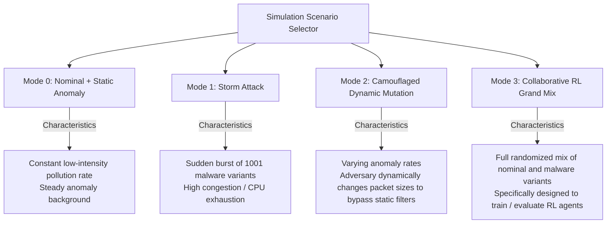

# V2X QoS Research: Evaluation Datasets and Attack Vectors

This directory contains the nominal baseline and mutated malicious packet payloads used to drive the V2X co-simulation telemetry streams.

---

## Directory Structure

```text
inputs/
├── attack_vectors/
│   └── malware/
│       ├── poc_mtu_limit.bin      # Reference Mutated ASN.1 MTU CWE-674 exploit
│       ├── amp_00000.bin          # Mutated binary payload variation 0
│       └── ...                    # (1001 malicious packet variants)
└── base_packets/
    └── nominal_normal.bin         # Standard nominal V2X packet (325 bytes)
```

---

## Packet Generation and CWE-674 / MTU Exploit

The evaluation simulations use two packet categories:
1. **Nominal Packets (base_packets/)**: Standard, valid ASN.1 encoded packet captures representing typical cooperative V2X message broadcasts (e.g. CAM/DENM). Typical size is 325 bytes.
2. **Malware Mutants (attack_vectors/malware/)**: Payloads modified to exploit parser limits. A prime example is triggering CWE-674 (Uncontrolled Recursion) or inflating packet sizes up to the ITS MTU boundary (1400 bytes). These mutations force the receiver's parser to spend excessive CPU cycles, leading to amplification attacks where a small attack payload inflicts severe packet processing latency on the victim station.

---

## Simulation Attack Scenario Modes

When calling the C++ execution binary or run_experiments.sh, you specify the simulation mode using the -m switch:



---

## Feeding Custom Packets

If you wish to test custom PCAP traces or newly generated mutated binaries:
1. Save your custom normal binary packet (raw bytes) inside `inputs/base_packets/`.
2. Save your custom mutated binary packets inside `inputs/attack_vectors/malware/`.
3. The C++ harness will automatically scan and load these files into memory buffers on startup.
