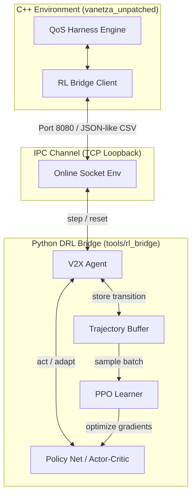

# V2X QoS Deep Reinforcement Learning Bridge
## Industrial Developer Reference Manual

This directory contains the reinforcement learning (RL) co-simulation bridge connecting the C++ V2X simulation harness (built on Vanetza) with PyTorch policy networks. The system uses Proximal Policy Optimization (PPO) to dynamically tune the mitigation parameters of an Adaptive Filter Finite State Machine (FSM), protecting V2X stacks against CWE-674 structural workload amplification.

---

## 1. System Architecture & Design Philosophy

The codebase is built on **Separation of Concerns (SoC)** and **SOLID** principles, isolating execution pipelines, environments, network interfaces, and mathematical optimization loops.



### Core Design Patterns:
* **Orchestrator Pattern (`src/main.py`)**: Acts as a centralized factory to initialize environments, policies, and learners based on the central YAML configuration.
* **Adapter Pattern (Action Adapter in `src/agents/v2x_agent.py`)**: Maps variable-dimension neural network outputs (e.g. 2D actions) into fixed 4D physical parameter ranges, filling in static defaults and enforcing safety boundaries.
* **Strategy Pattern (`src/algorithms/`)**: Defines interchangeable RL learner interfaces (`BaseLearner`), allowing PPO and SAC to be swapped transparently.

---

## 2. Mathematical Modeling & Core Formulations

To help engineers understand the training dynamics, the mathematical formulations used in the environments, models, and optimization updates are defined below.

### 2.1 Observation (State) Space Normalization
The network receives a 3-dimensional normalized observation vector $s_t \in \mathbb{R}^3$ at each control window boundary (every 1000 packets):

$$s_t = \begin{bmatrix} o_{\text{size}} \\ o_{\text{sq}} \\ o_{\text{anomaly}} \end{bmatrix}$$

1. **Normalized Packet Size ($o_{\text{size}}$)**: Maps raw packet length $S_{\text{raw}}$ (up to MTU) to $[0, 1]$:
   $$o_{\text{size}} = \frac{S_{\text{raw}}}{1500.0}$$
2. **Normalized Sum-of-Squares similarity ($o_{\text{sq}}$)**: Maps F2 sketch similarities $Q_{\text{avg}}$ (up to maximum signature value) to $[0, 1]$:
   $$o_{\text{sq}} = \frac{Q_{\text{avg}}}{65025.0}$$
3. **Raw Anomaly Ratio ($o_{\text{anomaly}}$)**: The ratio of malware packets $N_{\text{malware}}$ to total packets $N_{\text{total}}$ in the window:
   $$o_{\text{anomaly}} = \frac{N_{\text{malware}}}{N_{\text{total}}}$$

---

### 2.2 Action Space & Action Adapter Mapping
The model output action vector $a_t \in \mathbb{R}^d$ matches the active dimensions defined in the configuration. The **Action Adapter** maps the network's unbounded stochastic outputs to the valid physical simulation ranges $A_t \in \mathbb{R}^4$:

$$A_i = \text{clamp}\left( a_{\text{min}, i} + \text{sigmoid}(a_{t, i}) \cdot (a_{\text{max}, i} - a_{\text{min}, i}), \ a_{\text{min}, i}, \ a_{\text{max}, i} \right)$$

* **Recovery Rate Coefficient ($a_0$)**: Clamped to $[0.01, 0.10]$ (controls FSM budget recovery speed).
* **Mitigation Penalty Multiplier ($a_1$)**: Clamped to $[20.0, 100.0]$ (controls FSM budget deduction severity).
* **F2 Sketch Similarity Threshold ($a_2$)**: Clamped to $[400, 650]$ (controls FSM attack sensitivity).
* **Peacetime Active Inspection Sampling Rate ($a_3$)**: Clamped to $[0.05, 1.00]$ (controls S0 active audit rate).

---

### 2.3 Reward Shaping Formulations
The reward function dynamically switches between two modes depending on the current anomaly rate threshold (configured at $\theta = 0.005$):

#### A. Active Attack Mitigation Mode ($o_{anomaly} \ge \theta$):
Prioritizes preventing budget collapse and resource exhaustion.

$$R_{\text{attack}} = - \left( w_{\text{penalty}} \cdot a_1 + w_{\text{sq}} \cdot \left(\frac{a_2}{650}\right)^2 + w_{\text{budget}} \cdot V_{\text{budget}} \right)$$

* $w_{\text{penalty}} = 0.5$ (penalizes excessive rate limiting).
* $w_{\text{sq}} = 0.2$ (penalizes keeping sketch thresholds unnecessarily low).
* $w_{\text{budget}} = 10.0$ (heavily penalizes cases where remaining FSM CPU budget drops near zero).

#### B. Peacetime Mode ($o_{anomaly} < \theta$):
Prioritizes maximizing throughput and minimizing inspection overhead.

$$R_{\text{nominal}} = w_{\text{recovery}} \cdot a_0 - w_{\text{overhead}} \cdot a_3$$

* $w_{\text{recovery}} = 10.0$ (rewards fast budget recovery when no threat is present).
* $w_{\text{overhead}} = 8.0$ (penalizes high inspection sampling rates during peacetime).

---

### 2.4 Proximal Policy Optimization (PPO) Objectives
The policy network is trained using the PPO-Clip objective to stabilize updates.

#### A. Clipped Surrogate Objective:
$$L^{\text{CLIP}}(\theta) = \hat{\mathbb{E}}_t \left[ \min\left( r_t(\theta)\hat{A}_t, \ \text{clip}(r_t(\theta), 1-\epsilon, 1+\epsilon)\hat{A}_t \right) \right]$$

* $r_t(\theta) = \frac{\pi_\theta(a_t | s_t)}{\pi_{\theta_{\text{old}}}(a_t | s_t)}$ represents the probability ratio.
* $\epsilon = 0.2$ (clipping ratio).
* $\hat{A}_t$ is the Generalized Advantage Estimation (GAE).

#### B. Value Function Loss (Critic Objective):
$$L^{\text{VF}}(\theta) = \hat{\mathbb{E}}_t \left[ \left( V_\theta(s_t) - V^{\text{targ}}_t \right)^2 \right]$$

#### C. Entropy Bonus:
To encourage exploration and prevent premature policy convergence, an entropy term $H(\pi_\theta(\cdot | s_t))$ is added. The combined objective function updated via gradient ascent is:

$$\text{Maximize } L^{\text{PPO}}(\theta) = \hat{\mathbb{E}}_t \left[ L^{\text{CLIP}}(\theta) - c_1 L^{\text{VF}}(\theta) + c_2 H(\pi_\theta(\cdot | s_t)) \right]$$

* $c_1 = 0.5$ (value function coefficient).
* $c_2 = 0.01$ (entropy coefficient).

---

## 3. Directory Layout & Core Components

Below is a detailed breakdown of the classes and responsibilities within the package:

| Directory/File | Target Class/Module | Primary Responsibility |
| :--- | :--- | :--- |
| `src/config.py` | `Global Config Parser` | Parses `ppo_agent.yaml` and exposes system constants and bounds. |
| `src/main.py` | `main()` Orchestrator | CLI entry point. Sets up training modes and initializes pipelines. |
| `src/envs/base_env.py` | `BaseV2XEnv` | Abstract interface defining standardized `reset()` and `step()` loops. |
| `src/envs/online_socket_env.py`| `V2XOnlineSocketEnv` | Runs loopback TCP server on port 8080 to receive C++ telemetry and send actions. |
| `src/envs/offline_dataset_env.py`| `V2XOfflineDatasetEnv` | Simulates packet flows using CSV telemetry files for fast offline training. |
| `src/agents/base_agent.py` | `BaseV2XAgent` | Abstract interface for target agents. |
| `src/agents/v2x_agent.py` | `V2XAgent` | Manages the policy network and uses the **Action Adapter** to format actions. |
| `src/models/policy_net.py` | `DefencePolicyNet` | PyTorch network. Dynamically creates hidden layers from config. |
| `src/algorithms/base_learner.py`| `BaseLearner` | Abstract interface for learning algorithms. |
| `src/algorithms/ppo_learner.py`| `PPOLearner` | Evaluates loss gradients, applies entropy bonuses, and updates policy weights. |
| `src/utils/network_io.py` | `NetworkIOHelper` | Handles stateless CSV parsing and string formatting for TCP transmission. |
| `src/utils/data_loader.py` | `TraceLoader` | Blends historical trace CSV files into training matrices. |

---

## 4. Execution Commands (Direct Python vs. Root Bash Wrapper)

You can run experiments using either direct Python commands inside `tools/rl_bridge/` (ideal for debug hacking) or the unified `run_experiments.sh` wrapper script in the repository root (recommended for standard operation).

### Translation Reference Map:

| Execution Goal | Direct Python Command <br>*(Run inside `tools/rl_bridge/`)* | Equivalent Root Bash Command <br>*(Run in repository root)* |
| :--- | :--- | :--- |
| **1. Online Training (TCP Server)** | `python3 scripts/train_online.py` | `./run_experiments.sh python --train-online` |
| **2. Offline Training** | `python3 scripts/train_offline.py --rate mix --epochs 20` | `./run_experiments.sh python --train-offline -r mix -e 20` |
| **3. Production Serve Daemon** | `python3 scripts/serve_agent.py` | `./run_experiments.sh python --deploy` |
| **4. Brain Decision Auditing** | `python3 scripts/verify_brain.py -m checkpoints/v2x_offline_rmix_e20.pth` | `./run_experiments.sh python --verify-brain -m checkpoints/v2x_offline_rmix_e20.pth` |
| **5. Model Export to ONNX** | `python3 scripts/export_onnx.py` | `./run_experiments.sh python --export-onnx` |
| **6. Visualization Plotting** | `python3 ../plot_engine.py --all` | `./run_experiments.sh python --plot --all` |

---

## 5. Developer Guide (Deep Walkthrough Recipes)

This section provides step-by-step instructions and code details for expanding the RL bridge framework.

### 5.1 How to Adjust Neural Network Depth and Layers
The neural network's structural depth is defined dynamically in `config/ppo_agent.yaml`. To modify the capacity of the model, you can edit the architecture without rebuilding the harness.

#### Step 1: Open the configuration file
Open `config/ppo_agent.yaml` and look for the `models` block:
```yaml
models:
  hidden_layers:
    - 128
    - 128
    - 64
```
Modify the sizes or add entries. For example, to make it a deeper network with 4 hidden layers:
```yaml
models:
  hidden_layers:
    - 256
    - 256
    - 128
    - 64
```

#### Step 2: Customizing the Activation Function or Layer Types
If you want to customize the actual layers in PyTorch (e.g. swap `ReLU` for `Tanh` or add Batch Normalization), open **`src/models/policy_net.py`** and modify the `__init__` constructor.
Locate the loop creating the linear layers (around line 34):
```python
# [File: src/models/policy_net.py]
# Original loop:
for h_dim in hidden_layers:
    layers.append(nn.Linear(in_dim, h_dim))
    layers.append(nn.ReLU()) # <--- Replace nn.ReLU() with nn.Tanh() or similar
    in_dim = h_dim
```
You can rewrite it to add Batch Normalization or alternate activations:
```python
# Custom loop example:
for h_dim in hidden_layers:
    layers.append(nn.Linear(in_dim, h_dim))
    layers.append(nn.BatchNorm1d(h_dim)) # Added Batch Norm
    layers.append(nn.Tanh())             # Changed to Tanh activation
    in_dim = h_dim
```

---

### 5.2 How to Change Training Parameters (Training Depth & Hyperparameters)
You can tune learning parameters (the "training depth") globally in the configuration or directly via the command-line arguments.

#### Method A: Configuration file adjustments
Open `config/ppo_agent.yaml` and modify the training rates and discounts:
```yaml
# [File: config/ppo_agent.yaml]
hyperparameters:
  lr_online: 0.0003     # Policy network learning rate
  ppo_clip: 0.2         # PPO clipping limit (epsilon)
  batch_size: 32        # Number of control steps before running a PPO gradient step
  gamma: 0.99           # Discount factor for future rewards
  gae_lambda: 0.95      # GAE parameter for trade-off between bias and variance
```

#### Method B: Modifying the execution parameters (epochs, lr) via Bash
To increase training epochs or adjust the learning rate during offline training runs:
```bash
# Run a deeper search with 50 epochs and a lower learning rate (0.0001)
./run_experiments.sh python --train-offline -e 50 --lr 0.0001
```
*Behind the scenes, `-e 50` is mapped directly to `train_offline.py`'s `--epochs` parameter, modifying the loops in `src/main.py`.*

---

### 5.3 How to Implement and Register a New RL Algorithm (e.g., SAC)
To implement a custom continuous RL algorithm (such as Soft Actor-Critic), follow this step-by-step cookbook.

#### Step 1: Create the learner class
Create a new file **`src/algorithms/sac_learner.py`** and inherit from `BaseLearner`. Implement the `update` method:
```python
# [File: src/algorithms/sac_learner.py]
import torch
from src.algorithms.base_learner import BaseLearner

class SACLearner(BaseLearner):
    def __init__(self, policy_net, lr=0.0003):
        super().__init__(policy_net)
        # Initialize your SAC Q-networks, target networks, and optimizers here
        self.optimizer = torch.optim.Adam(self.policy_net.parameters(), lr=lr)
        print("  └── [INIT] SAC Learner successfully initialized.")
        
    def update(self, trajectory_buffer):
        """
        Executes Soft Actor-Critic gradient optimization.
        trajectory_buffer: dict containing lists of torch.Tensors (states, actions, rewards, etc.)
        """
        # 1. Parse buffer transitions
        states = torch.stack(trajectory_buffer["states"])
        actions = torch.stack(trajectory_buffer["actions"])
        
        # 2. (Algorithm-Specific Math) Compute Critic Loss & Actor Loss
        # Example dummy gradient step:
        loss = torch.tensor(0.0, requires_grad=True)
        
        self.optimizer.zero_grad()
        loss.backward()
        self.optimizer.step()
        
        # 3. Return dictionary of metrics for console printing
        return {
            "actor_loss": 0.0,
            "critic_loss": loss.item()
        }
```

#### Step 2: Register the new algorithm in the Orchestrator
Open **`src/main.py`** and import and register your new learner class in the `main()` method.
Locate the learner factory code block:
```python
# [File: src/main.py]
# Ingest the configured algorithm choice
algo_name = config.get("algorithm", "ppo").lower()

if algo_name == "ppo":
    learner = PPOLearner(policy_net, lr=lr, ppo_clip=ppo_clip)
elif algo_name == "sac":
    # ── REGISTER SAC HERE ──────────────────────────────────────────────────
    from src.algorithms.sac_learner import SACLearner
    learner = SACLearner(policy_net, lr=lr)
    # ───────────────────────────────────────────────────────────────────────
else:
    raise ValueError(f"Unsupported algorithm: {algo_name}")
```

#### Step 3: Launch training using the algorithm flag
You can now pass the `-a sac` parameter to select and execute the Soft Actor-Critic algorithm directly:
```bash
# Offline dataset training with SAC
./run_experiments.sh python --train-offline -a sac -e 20

# Online interactive training server with SAC
./run_experiments.sh python --train-online -a sac
```
*Note: If `-a` is omitted, the framework defaults to `"ppo"` (or whichever value is configured in `config/ppo_agent.yaml`).*

---

## 6. Troubleshooting & MLOps FAQ

**Q1: Address already in use (socket binding conflict / port 8080/9090 locked)**
* **Symptom**: `OSError: [Errno 98] Address already in use`
* **Resolution**: An old training session may still be running in the background. Kill the process occupying the port:
  ```bash
  sudo lsof -t -i:8080 | xargs kill -9
  ```

**Q2: ONNX Runtime Shape Mismatch when deploying to C++**
* **Symptom**: `[ERROR] Unexpected action dimensions: X`
* **Resolution**: The exported ONNX model's output size must match the configured action space. Ensure the C++ `rl_bridge.cpp` decoder block supports your selected output dimension (`action_dim` = 2, 3, or 4). If you change the action dimensions in Python, you must run the export pipeline again:
  ```bash
  ./run_experiments.sh python --export-onnx
  ```

**Q3: Virtual Environment (venv) missing packages or package imports failing**
* **Symptom**: `ModuleNotFoundError: No module named 'torch'`
* **Resolution**: Use the setup tool to rebuild the virtual environment and fetch missing dependencies:
  ```bash
  ./setup.sh python
  ```
