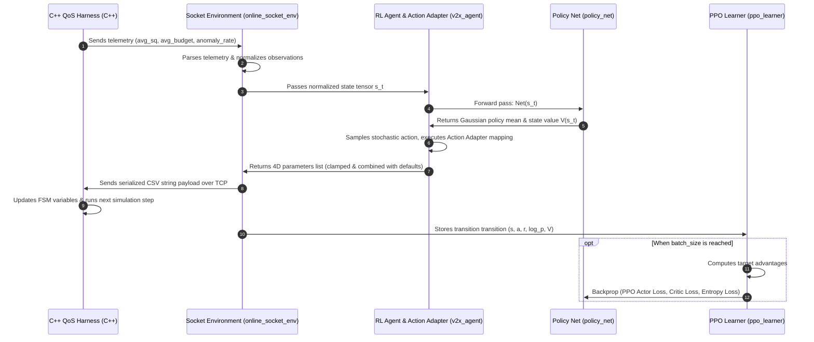

# V2X QoS Reinforcement Learning Bridge (Developer Guide)

This directory houses the Reinforcement Learning (RL) bridge linking the C++ V2X simulation harness with PyTorch deep learning models. Refactored around clean software engineering principles (Separation of Concerns and SOLID), this codebase separates environment interfaces, decision-making agents, optimization algorithms, and network transport formatting.

---

## 1. Directory Layout & Architecture

```text
tools/rl_bridge/
├── README.md                  # This documentation guide
├── config/
│   └── ppo_agent.yaml         # Centralized system configurations (hyperparameters, mapping, defaults)
├── checkpoints/               # Directory containing exported PyTorch weight files (*.pth)
├── data/                      # Place historical CSV trajectory training files here
├── scripts/                   # CLI entry points for orchestrating training/serving
│   ├── train_online.py        # Starts online interactive socket co-simulation training
│   ├── train_offline.py       # Starts offline batch dataset sweeps
│   ├── serve_agent.py         # Production daemon hosting models (inference-only)
│   └── verify_brain.py        # Diagnostic script checking policy outputs on scenario matrices
├── src/                       # Source package directory
│   ├── __init__.py
│   ├── config.py              # Ingests configuration and dynamically exposes constants
│   ├── main.py                # Core orchestrator executing either online or offline runs
│   ├── envs/                  # Environment simulator wrappers
│   │   ├── __init__.py
│   │   ├── base_env.py        # Gymnasium-style abstract environment interface
│   │   ├── online_socket_env.py # Gym-style socket server interface (handles TCP IPC)
│   │   └── offline_dataset_env.py # Gym-style CSV reader sliding window step interface
│   ├── agents/                # Decision wrappers
│   │   ├── __init__.py
│   │   ├── base_agent.py      # Abstract agent interface
│   │   └── v2x_agent.py       # V2X Agent managing policy model queries and the Action Adapter
│   ├── models/                # PyTorch neural layers
│   │   ├── __init__.py
│   │   └── policy_net.py      # Actor-Critic network (dynamic depth and widths)
│   ├── algorithms/            # Math optimization loops
│   │   ├── __init__.py
│   │   ├── base_learner.py    # Abstract base learner class
│   │   ├── ppo_learner.py     # PPO optimizer calculating Actor/Critic/Entropy losses
│   │   └── sac_learner.py     # Skeleton template illustrating another RL implementation
│   └── utils/                 # Utilities
│       ├── __init__.py
│       ├── network_io.py      # Stateless telemetry parsing and policy serialization
│       └── data_loader.py     # Ingests and blends offline CSV traces
```

---

## 2. Telemetry and Action Data Pathways

The co-simulation works as a transactional loop synchronizing Python and C++ over an IPv4 TCP Socket.

### A. Observation/Telemetry Path (Inbound)
1. The C++ simulator gathers telemetry statistics within a sliding time window.
2. C++ connects to Python over TCP and sends a CSV message containing three variables:
   `avg_max_sum_sq,avg_budget,anomaly_rate\n`
3. `online_socket_env` accepts the connection, reads the socket buffer, and delegates parsing to `NetworkIOHelper.parse_telemetry()`.
4. The environment applies feature normalization and returns a 3D PyTorch state tensor:
   `[avg_packet_size / 1500.0, avg_max_sum_sq / 65025.0, anomaly_rate]`

### B. Action Command Path (Outbound)
1. The state tensor is evaluated by `V2XAgent` through the policy network `DefencePolicyNet`.
2. The network outputs a raw vector matching the size of `rl_controlled_actions` (e.g., 2 variables: `recovery_rate`, `penalty_multiplier`).
3. The **Action Adapter** maps and clamps these active variables to their dynamic bounds.
4. The Action Adapter reads `wire_protocol_parameters` to build a combined action list, filling the remaining parameters with static defaults from the YAML configuration.
5. `NetworkIOHelper.serialize_policy()` formats the parameters sequentially:
   `val_0,val_1,val_2,val_3\n` (e.g. `recovery_rate,penalty_multiplier,sq_threshold,base_sampling_rate\n`)
6. `online_socket_env` transmits the string payload back to the socket and closes the connection.
7. The C++ client receives the packet, parses the 4 values, updates its local QoS configurations, and steps the simulator forward.

### C. Sequence Diagram



---

## 3. Running Execution Commands

Make sure to run all scripts from the `tools/rl_bridge/` folder using Python inside your virtual environment.

### A. Online Co-Simulation Training (TCP Socket Server)
Launches the socket server listening for live interactive C++ co-simulation connections.
```bash
python -m src.main --mode online --port 8080
# Or using the script CLI:
python scripts/train_online.py --port 8080 --batch 32
```

### B. Offline Batch Dataset Training
Loads pre-recorded traffic logs matching `data/training_trace_*_mode3.csv` to pre-train model checkpoints.
```bash
python -m src.main --mode offline --epochs 20 --rate mix
# Or using the script CLI:
python scripts/train_offline.py --rate mix --epochs 20 --lr 0.001
```

### C. Live Serving Daemon (Inference Only)
Hosts a live server that uses optimal deterministic weights (no exploration noise) to serve defense parameters to the simulator in production.
```bash
python scripts/serve_agent.py
```

### D. Verification Audit Script
Evaluates model actions against two predefined test scenarios (nominal traffic and attack storm) to audit model decisions.
```bash
python scripts/verify_brain.py -m checkpoints/v2x_offline_rmix_e20.pth
```

---

## 4. Developer Extension Guide

All runtime updates can be implemented entirely in Python and YAML, without modifying the compiled C++ code.

### A. Adjusting Neural Network Architecture (Layer Depth/Width)
To change neural network capacity, open `config/ppo_agent.yaml` and edit the `models` layer array:
```yaml
models:
  hidden_layers:
    - 128
    - 128
    - 64
```
The constructor in `src/models/policy_net.py` reads this array at startup and dynamically builds the network using `nn.ModuleList`. **No code modifications are required.**

### B. Changing Parameters Under RL Control (Zero-Code)
If you want to start simple (e.g. control only 2 variables) and scale up, modify `action_space` inside `config/ppo_agent.yaml`:
```yaml
action_space:
  # Parameters under RL control (PyTorch output dimension matches this size)
  rl_controlled_actions:
    - recovery_rate
    - penalty_multiplier

  # Fallback default values for parameters NOT under RL control
  static_defaults:
    sq_threshold: 650.0
    base_sampling_rate: 0.05
```
* If a parameter is listed in `rl_controlled_actions`, the policy network will dynamically resize to control it.
* If a parameter is removed from `rl_controlled_actions`, the Action Adapter will automatically fill it with its `static_defaults` value when sending commands to C++.

### C. Adding a New 5th Parameter to the Protocol
To add a new parameter to your simulation framework:
1. Open `config/ppo_agent.yaml`.
2. Add your variable name to `wire_protocol_parameters` in the position expected by the C++ parser:
   ```yaml
   wire_protocol_parameters:
     - recovery_rate
     - penalty_multiplier
     - sq_threshold
     - base_sampling_rate
     - new_inspection_rate # Added
   ```
3. Put the variable under either `static_defaults` (if fixed) or `rl_controlled_actions` (if learned).
4. Update the C++ client code to split and read the 5th item in the received TCP CSV string. **Zero Python changes are required.**

### D. Implementing a New Reinforcement Learning Algorithm (e.g. SAC)
1. Under `src/algorithms/`, create a class inheriting from `BaseLearner` (e.g., see the code template in `src/algorithms/sac_learner.py`):
   ```python
   from src.algorithms.base_learner import BaseLearner
   
   class SACLearner(BaseLearner):
       def update(self, trajectory_buffer):
           # Calculate SAC Q-losses, Policy losses, temperature optimization, and apply gradients
           return {"actor_loss": actor_loss.item(), "critic_loss": critic_loss.item()}
   ```
2. Update the Factory builder in `src/main.py` (`main()` method) to register your new class.
3. Switch the active optimizer inside `config/ppo_agent.yaml`:
   ```yaml
   algorithm: "sac"
   ```

---

## 5. Standard Component Interfaces

### A. Environment (`src/envs/base_env.py`)
```python
class BaseV2XEnv(ABC):
    def reset(self) -> torch.Tensor:
        """Returns normalized initial state observation [3]"""
    def step(self, action: list) -> Tuple[torch.Tensor, float, bool, Dict[str, Any]]:
        """Sends action parameters list, blocks until next telemetry response, returns (s', r, done, info)"""
```

### B. Agent (`src/agents/base_agent.py`)
```python
class BaseV2XAgent(ABC):
    def act(self, state_tensor: torch.Tensor) -> Tuple[torch.Tensor, Tuple[list, list], torch.Tensor, torch.Tensor]:
        """Runs policy forward pass, outputs actions, runs Action Adapter, and returns transition elements"""
```

### C. Learner (`src/algorithms/base_learner.py`)
```python
class BaseLearner(ABC):
    def update(self, trajectory_buffer: Dict[str, List[torch.Tensor]]) -> Dict[str, float]:
        """Calculates loss updates (Actor/Critic/Entropy) and executes optimization gradient steps"""
```
