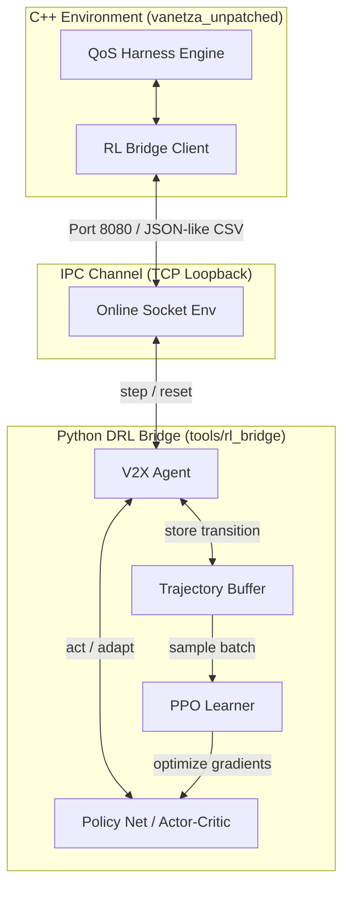

# V2X QoS Deep Reinforcement Learning Bridge
## Industrial Developer Reference Manual

This directory contains the reinforcement learning (RL) co-simulation bridge connecting the C++ V2X simulation harness (built on Vanetza) with PyTorch policy networks. The system uses Proximal Policy Optimization (PPO) to dynamically tune the mitigation parameters of an Adaptive Filter Finite State Machine (FSM), protecting V2X stacks against CWE-674 structural workload amplification.

---

## 1. System Architecture & Design Philosophy

The codebase is built on **Separation of Concerns (SoC)** and **SOLID** principles, isolating execution pipelines, environments, network interfaces, and mathematical optimization loops.



### Core Design Patterns:
* **Registry Pattern (`src/utils/registry.py`)**: Decouples the launchers (`main.py`, script entries) from specific algorithm classes. Builder callbacks register themselves dynamically via `@register_algorithm(name)` and are lazy-loaded via `importlib` to comply with the Open-Closed Principle (OCP).
* **Strategy Pattern (`src/envs/translators.py` and `src/envs/rewards.py`)**: Decouples environment logic from optimization objectives and action mapping. Standard environments (`V2XOnlineSocketEnv` and `V2XOfflineDatasetEnv`) receive injected `ActionTranslator` and `RewardStrategy` implementations on construction, allowing PPO (continuous) and DQN (discrete) to run transparently on symmetric loop loops.
* **Graph-Embedded Adapter (`scripts/export_onnx.py`)**: Wrap discrete models (like DQN) inside deployment wrappers during serialization, embedding argmax, parameter mapping, and safety clamping directly inside the ONNX graph. This keeps the C++ client's binary contract clean and 100% algorithm-agnostic.

---

## 2. Mathematical Modeling & Core Formulations

To help engineers understand the training dynamics, the mathematical formulations used in the environments, models, and optimization updates are defined below.

### 2.1 Observation (State) Space Normalization
The network receives a 3-dimensional normalized observation vector $s_t \in \mathbb{R}^3$ at each control window boundary (every 1000 packets):

$$s_t = \begin{bmatrix} o_{\text{size}} \\ o_{\text{sq}} \\ o_{\text{anomaly}} \end{bmatrix}$$

1. **Normalized Packet Size ($o_{\text{size}}$)**: Maps raw packet length $S_{\text{raw}}$ (up to MTU) to $[0, 1]$:
   $$o_{\text{size}} = \frac{S_{\text{raw}}}{1500.0}$$
2. **Normalized Sum-of-Squares similarity ($o_{\text{sq}}$)**: Maps F2 sketch similarities $Q_{\text{avg}}$ (up to maximum signature value) to $[0, 1]$:
   $$o_{\text{sq}} = \frac{Q_{\text{avg}}}{65025.0}$$
3. **Raw Anomaly Ratio ($o_{\text{anomaly}}$)**: The ratio of malware packets $N_{\text{malware}}$ to total packets $N_{\text{total}}$ in the window:
   $$o_{\text{anomaly}} = \frac{N_{\text{malware}}}{N_{\text{total}}}$$

---

### 2.2 Action Space & Action Adapter Mapping
The model output action vector $a_t \in \mathbb{R}^d$ matches the active dimensions defined in the configuration. The **Action Adapter** maps the network's unbounded stochastic outputs to the valid physical simulation ranges $A_t \in \mathbb{R}^4$:

$$A_i = \text{clamp}\left( a_{\text{min}, i} + \text{sigmoid}(a_{t, i}) \cdot (a_{\text{max}, i} - a_{\text{min}, i}), \ a_{\text{min}, i}, \ a_{\text{max}, i} \right)$$

* **Recovery Rate Coefficient ($a_0$)**: Clamped to $[0.01, 0.10]$ (controls FSM budget recovery speed).
* **Mitigation Penalty Multiplier ($a_1$)**: Clamped to $[20.0, 100.0]$ (controls FSM budget deduction severity).
* **F2 Sketch Similarity Threshold ($a_2$)**: Clamped to $[400, 650]$ (controls FSM attack sensitivity).
* **Peacetime Active Inspection Sampling Rate ($a_3$)**: Clamped to $[0.05, 1.00]$ (controls S0 active audit rate).

---

### 2.3 Reward Shaping Formulations
The reward function dynamically switches between two modes depending on the current anomaly rate threshold (configured at $\theta = 0.005$):

#### A. Active Attack Mitigation Mode ($o_{\text{anomaly}} \ge \theta$):
Prioritizes preventing budget collapse and resource exhaustion.

$$R_{\text{attack}} = - \left( w_{\text{penalty}} \cdot a_1 + w_{\text{sq}} \cdot \left(\frac{a_2}{650}\right)^2 + w_{\text{budget}} \cdot V_{\text{budget}} \right)$$

* $w_{\text{penalty}} = 0.5$ (penalizes excessive rate limiting).
* $w_{\text{sq}} = 0.2$ (penalizes keeping sketch thresholds unnecessarily low).
* $w_{\text{budget}} = 10.0$ (heavily penalizes cases where remaining FSM CPU budget drops near zero).

#### B. Peacetime Mode ($o_{\text{anomaly}} < \theta$):
Prioritizes maximizing throughput and minimizing inspection overhead.

$$R_{\text{nominal}} = w_{\text{recovery}} \cdot a_0 - w_{\text{overhead}} \cdot a_3$$

* $w_{\text{recovery}} = 10.0$ (rewards fast budget recovery when no threat is present).
* $w_{\text{overhead}} = 8.0$ (penalizes high inspection sampling rates during peacetime).

---

### 2.4 Proximal Policy Optimization (PPO) Objectives
The policy network is trained using the PPO-Clip objective to stabilize updates.

#### A. Clipped Surrogate Objective:
$$L^{\text{CLIP}}(\theta) = \hat{\mathbb{E}}_t \left[ \min\left( r_t(\theta)\hat{A}_t, \ \text{clip}(r_t(\theta), 1-\epsilon, 1+\epsilon)\hat{A}_t \right) \right]$$

* $r_t(\theta) = \frac{\pi_\theta(a_t | s_t)}{\pi_{\theta_{\text{old}}}(a_t | s_t)}$ represents the probability ratio.
* $\epsilon = 0.2$ (clipping ratio).
* $\hat{A}_t$ is the Generalized Advantage Estimation (GAE).

#### B. Value Function Loss (Critic Objective):
$$L^{\text{VF}}(\theta) = \hat{\mathbb{E}}_t \left[ \left( V_\theta(s_t) - V^{\text{targ}}_t \right)^2 \right]$$

#### C. Entropy Bonus:
To encourage exploration and prevent premature policy convergence, an entropy term $H(\pi_\theta(\cdot | s_t))$ is added. The combined objective function updated via gradient ascent is:

$$\text{Maximize } L^{\text{PPO}}(\theta) = \hat{\mathbb{E}}_t \left[ L^{\text{CLIP}}(\theta) - c_1 L^{\text{VF}}(\theta) + c_2 H(\pi_\theta(\cdot | s_t)) \right]$$

* $c_1 = 0.5$ (value function coefficient).
* $c_2 = 0.01$ (entropy coefficient).

---

## 3. Directory Layout & Core Components

Below is a detailed breakdown of the classes and responsibilities within the package:

| Directory/File | Target Class/Module | Primary Responsibility |
| :--- | :--- | :--- |
| `src/config.py` | `Global Config Parser` | Parses centralized `agent.yaml` and exposes system constants, bounds, and dynamic algorithm checkpoints suffix resolution. |
| `src/main.py` | `main()` Orchestrator | CLI entry point. Sets up training modes and compiles pipelines dynamically via `get_algorithm_builder`. |
| `src/envs/base_env.py` | `BaseV2XEnv` | Abstract interface defining standardized `reset()` and `step()` loops. |
| `src/envs/online_socket_env.py`| `V2XOnlineSocketEnv` | Runs loopback TCP server on port 8080. Ingests strategy classes for action mapping and reward calculations. |
| `src/envs/offline_dataset_env.py`| `V2XOfflineDatasetEnv` | Simulates packet flows using CSV telemetry files. Ingests strategy classes for symmetric execution. |
| `src/envs/translators.py` | `ActionTranslator` | Strategy class mappings: `PpoActionTranslator` (continuous) vs. `DqnActionTranslator` (discrete). |
| `src/envs/rewards.py` | `RewardStrategy` | Strategy class mappings: `PpoSurrogateReward` (surrogate optimization) vs. `DqnSamplingReward` (delta-based exploration reward). |
| `src/agents/base_agent.py` | `BaseV2XAgent` | Abstract interface for target agents. |
| `src/agents/v2x_agent.py` | `V2XAgent` | Continuous PPO agent managing target actor network weights. |
| `src/agents/dqn_agent.py` | `DQNAgent` | Discrete DQN agent running epsilon-greedy exploration. |
| `src/models/policy_net.py` | `DefencePolicyNet` | PyTorch Actor-Critic network. Dynamically creates shared torso layers. |
| `src/models/dqn_net.py` | `DQNNet` | PyTorch Q-network mapping input state dimensions to discrete action selections. |
| `src/algorithms/base_learner.py`| `BaseLearner` | Abstract interface for learning algorithms. |
| `src/algorithms/ppo_learner.py`| `PPOLearner` | Computes policy/value losses, registers itself under `"ppo"`. |
| `src/algorithms/dqn_learner.py`| `DQNLearner` | Performs Bellman optimization updates using a pre-allocated `TensorReplayBuffer`, registers itself under `"dqn"`. |
| `src/utils/registry.py` | `Dynamic Registry` | compliantly handles OCP modular lazy imports and dynamic algorithm mappings. |
| `src/utils/network_io.py` | `NetworkIOHelper` | Handles 40-byte binary packet serialization and metrics calculations (FPR, FNR, Recall). |
| `src/utils/data_loader.py` | `TraceLoader` | Blends historical trace CSV files into training matrices. |

---

## 4. Execution Commands (Direct Python vs. Root Bash Wrapper)

You can run experiments using either direct Python commands inside `tools/rl_bridge/` (ideal for debug hacking) or the unified `run_experiments.sh` wrapper script in the repository root (recommended for standard operation).

### Translation Reference Map:

| Execution Goal | Direct Python Command <br>*(Run inside `tools/rl_bridge/`)* | Equivalent Root Bash Command <br>*(Run in repository root)* |
| :--- | :--- | :--- |
| **1. Online Training (TCP Server)** | `python3 scripts/train_online.py` | `./run_experiments.sh python --train-online` |
| **2. Offline Training** | `python3 scripts/train_offline.py --rate mix --epochs 20` | `./run_experiments.sh python --train-offline -r mix -e 20` |
| **3. Production Serve Daemon** | `python3 scripts/serve_agent.py` | `./run_experiments.sh python --deploy` |
| **4. Brain Decision Auditing** | `python3 scripts/verify_brain.py -m checkpoints/v2x_offline_rmix_e20.pth` | `./run_experiments.sh python --verify-brain -m checkpoints/v2x_offline_rmix_e20.pth` |
| **5. Model Export to ONNX** | `python3 scripts/export_onnx.py` | `./run_experiments.sh python --export-onnx` |
| **6. Visualization Plotting** | `python3 ../plot_engine.py --all` | `./run_experiments.sh python --plot --all` |

---

## 5. Developer Guide (Deep Walkthrough Recipes)

This section provides step-by-step instructions and code details for expanding the RL bridge framework.

### 5.1 How to Adjust Neural Network Depth and Layers
The neural network's structural depth is defined dynamically in `config/ppo_agent.yaml`. To modify the capacity of the model, edit the architecture in the configuration.

#### Step 1: Open the configuration file
Open `config/ppo_agent.yaml` and look for the `models` block:
```yaml
models:
  hidden_layers:
    - 128
    - 128
    - 64
```
Modify the sizes or add entries. For example, to make it a deeper network with 4 hidden layers:
```yaml
models:
  hidden_layers:
    - 256
    - 256
    - 128
    - 64
```

#### Step 2: Customizing the Activation Function or Layer Types in PyTorch
To customize the actual layers in PyTorch (e.g. swap `ReLU` for `Tanh` or add Batch Normalization), open **`src/models/policy_net.py`** and modify the `__init__` constructor.
Locate the loop creating the linear layers (around line 34):
```python
# [File: src/models/policy_net.py]
# Original loop:
for h_dim in hidden_layers:
    layers.append(nn.Linear(in_dim, h_dim))
    layers.append(nn.ReLU()) # <--- Replace nn.ReLU() with nn.Tanh() or similar
    in_dim = h_dim
```
You can rewrite it to add Batch Normalization or alternate activations:
```python
# Custom loop example:
for h_dim in hidden_layers:
    layers.append(nn.Linear(in_dim, h_dim))
    layers.append(nn.BatchNorm1d(h_dim)) # Added Batch Norm
    layers.append(nn.Tanh())             # Changed to Tanh activation
    in_dim = h_dim
```

---

### 5.2 How to Change Training Parameters (Training Depth & Hyperparameters)
You can tune learning parameters (the "training depth") globally in the configuration or directly via the command-line arguments.

#### Method A: Configuration file adjustments
Open `config/ppo_agent.yaml` and modify the training rates and discounts:
```yaml
# [File: config/ppo_agent.yaml]
hyperparameters:
  lr_online: 0.0003     # Policy network learning rate
  ppo_clip: 0.2         # PPO clipping limit (epsilon)
  batch_size: 32        # Number of control steps before running a PPO gradient step
  gamma: 0.99           # Discount factor for future rewards
  gae_lambda: 0.95      # GAE parameter for trade-off between bias and variance
```

#### Method B: Modifying the execution parameters (epochs, lr) via Bash
To increase training epochs or adjust the learning rate during offline training runs:
```bash
# Run a deeper search with 50 epochs and a lower learning rate (0.0001)
./run_experiments.sh python --train-offline -e 50 --lr 0.0001
```
*Behind the scenes, `-e 50` is mapped directly to `train_offline.py`'s `--epochs` parameter, modifying the loops in `src/main.py`.*

---

### 5.3 How to Implement and Register a New RL Algorithm (e.g., SAC)
To implement a custom RL algorithm (such as Soft Actor-Critic), follow this step-by-step cookbook.

#### Step 1: Create the learner class & builder function
Create a new file **`src/algorithms/sac_learner.py`** and inherit from `BaseLearner`. Implement the `update` method, and decorate the pipeline builder function using `@register_algorithm("sac")`.

```python
# [File: src/algorithms/sac_learner.py]
import torch
from typing import Dict, List, Any, Tuple
from src.algorithms.base_learner import BaseLearner
from src.utils.registry import register_algorithm

class SACLearner(BaseLearner):
    def __init__(self, agent: Any = None, lr: float = 0.0003):
        self.agent = agent
        self.lr = lr
        
    def update(self, trajectory_buffer: Dict[str, List[torch.Tensor]]) -> Dict[str, float]:
        """
        Executes Soft Actor-Critic gradient optimization.
        """
        # (Algorithm-Specific Math) Update Q-networks and policy networks
        return {
            "actor_loss": 0.0,
            "critic_loss": 0.0,
            "entropy": 0.0,
            "total_loss": 0.0
        }

# ── DYNAMIC OCP REGISTRATION ──────────────────────────────────────────────────
@register_algorithm("sac")
def build_sac_pipeline(lr: float, port: int, mode: str, raw_data=None) -> Tuple[Any, Any, Any]:
    """
    Dynamic SAC pipeline builder. Instantiates its own model, agent, environment,
    translators, and rewards strategies, leaving scripts untouched.
    """
    from src.models.policy_net import DefencePolicyNet
    from src.agents.v2x_agent import V2XAgent
    from src.envs.online_socket_env import V2XOnlineSocketEnv
    from src.envs.offline_dataset_env import V2XOfflineDatasetEnv
    from src.envs.translators import PpoActionTranslator
    from src.envs.rewards import PpoSurrogateReward
    from src.config import RAW_CFG
    
    # 1. Strategies setup
    translator = PpoActionTranslator()
    reward_strategy = PpoSurrogateReward(
        sensitivity_threshold=RAW_CFG["reward_shaping"]["anomaly_sensitivity_threshold"],
        w_active=RAW_CFG["reward_shaping"]["active_attack_weights"],
        w_nominal=RAW_CFG["reward_shaping"]["nominal_traffic_weights"]
    )
    
    # 2. Network and agent setup
    model = DefencePolicyNet()
    agent = V2XAgent(model)
    
    # 3. Environment setup
    if mode == "online":
        env = V2XOnlineSocketEnv(port=port, action_translator=translator, reward_strategy=reward_strategy)
    else:
        env = V2XOfflineDatasetEnv(raw_data=raw_data, action_translator=translator, reward_strategy=reward_strategy)
        
    learner = SACLearner(agent, lr=lr)
    return env, agent, learner
# ───────────────────────────────────────────────────────────────────────────────
```

#### Step 2: Lazy Loading Verification
Because `get_algorithm_builder` uses `importlib` to dynamically import `src.algorithms.{algo_name}_learner`, simply naming your file **`sac_learner.py`** and putting it under `src/algorithms/` enables **zero-touch registration**. You do not need to edit `main.py` or any other scripts.

#### Step 3: Launch training using the algorithm flag
You can now pass the `-a sac` parameter to select and execute the Soft Actor-Critic algorithm directly:
```bash
# Offline dataset training with SAC
./run_experiments.sh python --train-offline -a sac -e 20

# Online interactive training server with SAC
./run_experiments.sh python --train-online -a sac
```
*Note: If `-a` is omitted, the framework defaults to `"dqn"` (or whichever value is configured in `config/agent.yaml`).*

---

### 5.4 Dynamic Weight Postfix Mapping & Overwrite Prevention
To prevent multiple algorithms from overriding the same checkpoints, `src/config.py` automatically resolves the save/load path of model checkpoints by appending `_{algorithm}` to the file name dynamically:
* Running DQN saves to `checkpoints/v2x_online_brain_dqn.pth` and `checkpoints/v2x_offline_rmix_e20_dqn.pth`.
* Running PPO saves to `checkpoints/v2x_online_brain_ppo.pth` and `checkpoints/v2x_offline_rmix_e20_ppo.pth`.

The ONNX exporter dynamically inspects these checkpoints and exports:
* PPO model -> `checkpoints/v2x_agent_ppo.onnx`
* DQN model -> `checkpoints/v2x_agent_dqn.onnx` (using the 4D deployment wrapper)

---

### 5.5 Production Inference Server Deployment (Noise-Free Eval Mode)
Once interactive training converges, exploration noise must be deactivated to maximize defensive stability. The production server loads the trained weights, locks the layers into deterministic execution (`model.eval()`), and maps actions directly to their mathematical mean values to crush low-density exploit leakage.

```bash
# Step 1: Spin up the inference daemon targeting your newly trained DQN model
./run_experiments.sh python --deploy -m checkpoints/v2x_online_brain_dqn.pth

# Step 2: In a separate terminal, execute the verification sweep on the C++ side
./run_experiments.sh unpatched --train-rl
```

---

## 6. Troubleshooting & MLOps FAQ

**Q1: Address already in use (socket binding conflict / port 8080/9090 locked)**
* **Symptom**: `OSError: [Errno 98] Address already in use`
* **Resolution**: An old training session may still be running in the background. Kill the process occupying the port:
  ```bash
  sudo lsof -t -i:8080 | xargs kill -9
  ```

**Q2: ONNX Runtime Shape Mismatch when deploying to C++**
* **Symptom**: `[ERROR] Unexpected action dimensions: X`
* **Resolution**: The C++ ONNX client requires a 4D output signature. If you are using DQN (which natively outputs 5D Q-values), ensure you export the model using the dynamic wrapper by running the export script. The wrapper will compile `argmax` and FSM parameter mapping into the ONNX graph so that the model outputs the correct 4D continuous vector:
  ```bash
  ./run_experiments.sh python --export-onnx -m checkpoints/v2x_online_brain_dqn.pth
  ```

**Q3: Virtual Environment (venv) missing packages or package imports failing**
* **Symptom**: `ModuleNotFoundError: No module named 'torch'`
* **Resolution**: Use the setup tool to rebuild the virtual environment and fetch missing dependencies:
  ```bash
  ./setup.sh python
  ```
