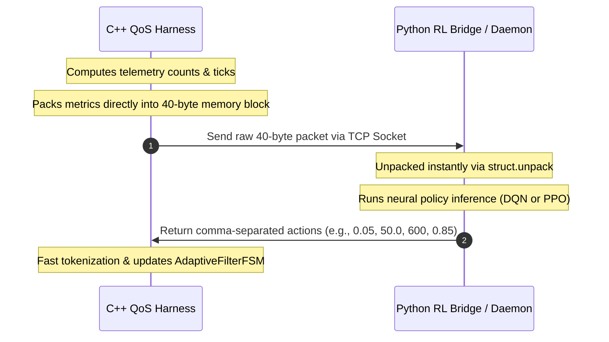
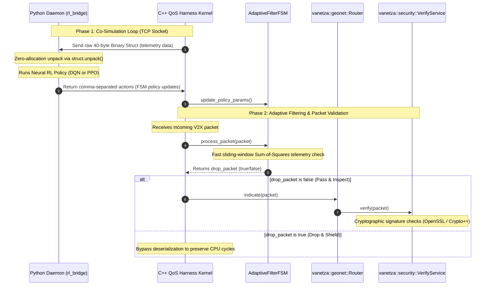
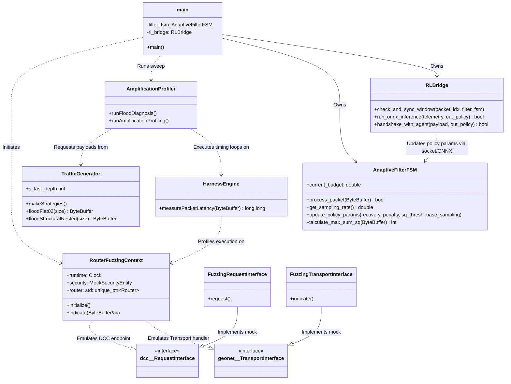
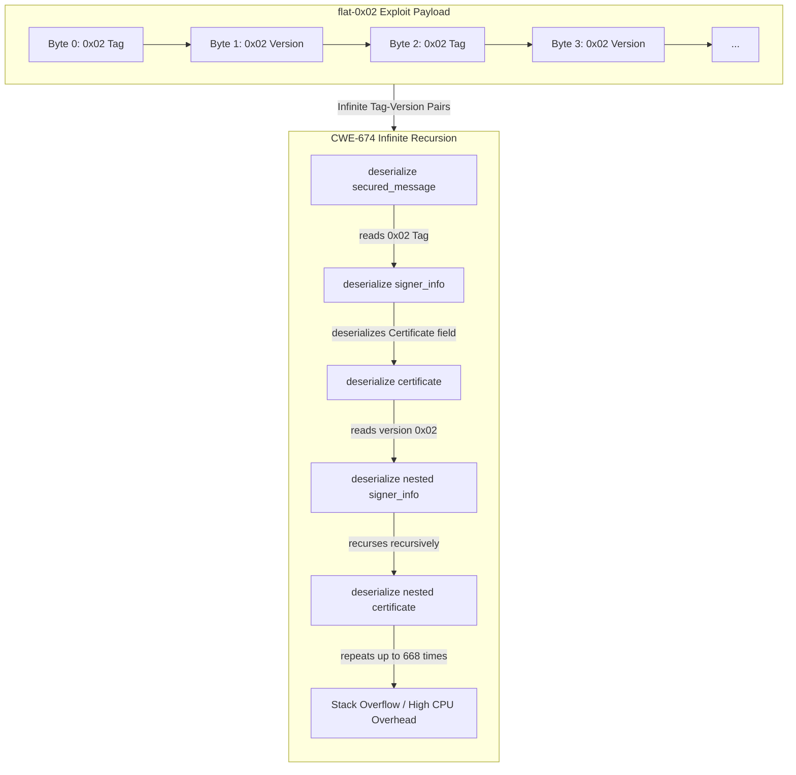
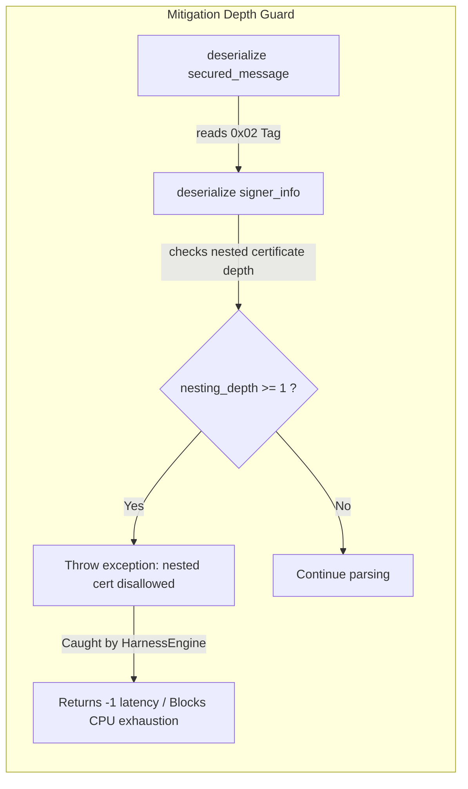

# V2X QoS Harness: C++ Evaluation Kernel

This directory houses the C++ benchmarking evaluation kernel for the V2X ratio-control research project. It simulates live ITS G5 station queues, handles ASN.1 mutated packet parsing, and coordinates mitigation thresholds using either Python socket server endpoints or in-process ONNX Runtime neural inference.

---

## Architectural Overview and Low-Overhead IPC

A major engineering focus was minimizing latency and overhead during interactive Python-C++ co-simulation. Standard serialization formats (like JSON) introduce severe text encoding/decoding latency and frequent memory allocations, which distort simulation timing. 

To resolve this, we implemented a Zero-Allocation C-Struct Binary Layout:



### The 40-Byte Telemetry Payload Alignment

Telemetry is packed into a fixed-size C-struct (`<IIIIIQQf` format) of exactly 40 bytes:

| Offset (Bytes) | Field Name | Data Type | Size (Bytes) | Description |
| :--- | :--- | :--- | :--- | :--- |
| **0 - 3** | `tp_count` | `uint32_t` | 4 | True Positives (Detected malware packets) |
| **4 - 7** | `tn_count` | `uint32_t` | 4 | True Negatives (Passed normal packets) |
| **8 - 11** | `fp_count` | `uint32_t` | 4 | False Positives (Incorrectly blocked benign) |
| **12 - 15** | `fn_count` | `uint32_t` | 4 | False Negatives (Leaked malware packets) |
| **16 - 19** | `inspected_count` | `uint32_t` | 4 | Total number of packets inspected |
| **20 - 27** | `total_sq` | `uint64_t` | 8 | Accumulated Sum of Squares (Queue feature) |
| **28 - 35** | `total_latency_ticks` | `uint64_t` | 8 | Total CPU clock cycles spent in inspection |
| **36 - 39** | `instant_sampling_rate` | `float` | 4 | Current C++ FSM gate sampling rate |

This guarantees zero string allocations on serialization, fits within a single TCP packet payload (bypassing Nagle's algorithm delay if combined with TCP_NODELAY), and can be unpacked instantly in Python with zero parsing overhead.

---

## Command-Line Arguments

The compiled executable `qos-harness` supports the following parameter switches:

```text
Usage: qos-harness [options]
Options:
  -h               Print help information and exit
  --build-dataset  Collect and dump raw features to outputs/csv_raw/
  --profile-amp    Run mathematical amplification profiling
  --diagnose-flood Run static diagnostics on mutated ASN.1 structures
  --rl             Enable collaborative DRL training mode (connects to socket)
  --onnx <path>    Load ONNX model for in-process local inference deployment
  --disable-safety Disable safe recovery FSM boundary clamps (Dangerous)
  -f               Manually enable C++ FSM mitigation filter
  -t <int>         Total simulation packet count (default: 1,000,000)
  -p <float>       Malicious packet pollution rate (e.g. 5.0 for 5%)
  -m <int>         Simulation attack scenario mode (0, 1, 2, or 3)
```

---

## Console Telemetry UI Layout

The real-time status output utilizes standard ASCII box borders. To prevent line stretching in consoles, follow these exact column padding rules:
* **Diagnosis & Profiler Boxes**: Inner width must be 62 characters (total width: 64 including borders).
* **Telemetry Complete & Summary Boxes**: Inner width must be 81 characters (total width: 83 including borders).

---

## CWE-674 Profiling & Mitigation Architecture

To evaluate the CWE-674 Workload Amplification vulnerability (recursive certificate parsing) and verify the patch, we updated the C++ benchmarking kernel with a reproducible, noise-resilient profiling architecture. Below is the multi-layered design mapping.

### Layer 1: Co-Simulation & IPC Architecture (System Level)

This layer manages the interactive Python-C++ co-simulation. We use a **Zero-Allocation C-Struct Binary Layout** over TCP socket connections. This bypasses text serialization overhead (like JSON/XML), ensuring that IPC latency does not distort experimental timing.



---

### Layer 2: Subsystem Relationships & Interface Design (Component Level)

To maintain the **Separation of Concerns (SoC)** principle, all evaluation, fuzzed packet generation, and latency measuring logic are decoupled into helper modules, leaving the baseline core `vanetza` stack untouched:



- **`RouterFuzzingContext`**: Implements mock DCC and transport interfaces (`FuzzingRequestInterface`/`FuzzingTransportInterface`) to sandbox the protocol stack, allowing wireless-free packet processing.
- **`HarnessEngine`**: Runs timing benchmarks on packet operations using high-resolution nanosecond clock offsets and catches hardware/software exception faults.
- **`TrafficGenerator`**: Coordinates the payload building strategies, managing the nested certificate chain serialization.
- **`AmplificationProfiler`**: The benchmark orchestrator that sweeps sizes, executes tests, and dumps statistics.

---

### Layer 2.5: Adaptive Filter FSM Mitigation Mechanism (Mitigation Level)

The `AdaptiveFilterFSM` is a lightweight, low-overhead security pre-filter executing in the C++ packet reception fast path. It operates as follows:

1. **State Machine & Jitter Budget**:
   - The FSM transits through four security states: `S0_NORMAL`, `S1_ELEVATED`, `S2_CONSTRAINED`, and `S3_QUARANTINE`.
   - Transitions are driven by a dynamic `current_budget` variable (bounded by `MAX_BUDGET = 100.0`), which increases upon detecting latency anomalies or payload byte distortions, and decreases over time via `RECOVERY_RATE`.
2. **Zero-Decoding Sliding Window Feature Extraction (Sum-of-Squares)**:
   - Instead of running expensive ASN.1 deserialization on every packet (which triggers stack exhaustion under attack), the FSM extracts a lightweight telemetry feature using `calculate_max_sum_sq`.
   - It runs a sliding window of size 64 across the initial bytes, computing the accumulated sum of squares. If the byte values deviate heavily from standard normal formats (exceeding `SQ_THRESHOLD`), the packet triggers a latency penalty.
3. **Budget-to-Sampling Rate Mapping**:
   - The FSM dynamically lowers the validation sampling rate to preserve CPU cycles when the budget spikes (e.g. entering quarantine):
     - `current_budget <= 40.0` ($\tau_2$): $100\%$ check rate.
     - `40.0 < current_budget <= 70.0` ($\tau_1$): Linear interpolation down to $50\%$ check rate.
     - `70.0 < current_budget < 100.0`: Linear interpolation down to `BASE_SAMPLING_RATE` ($10\%$).
   - A fast, zero-allocation Xorshift random number generator (`fast_rand()`) decides whether to bypass cryptographic decoding for non-sampled packets, shielding the receiver under heavy DDoS floods.

---

<details>
<summary><b>📐 Technical Specification: FSM Mathematical Model & Heuristics (Click to expand)</b></summary>

Here we detail the internal heuristics, mathematical state transition thresholds, and algorithm formulas of the `AdaptiveFilterFSM` for academic reference.

### 1. Mathematical Symbol Mapping Table
To align C++ implementation variables with academic writing conventions, we map code variables to standard mathematical notations:

| Mathematical Notation | Implementation Variable | Description |
| :--- | :--- | :--- |
| $B$ | `current_budget` | Dynamic virtual CPU budget (State coordinator) |
| $B_{\text{max}}$ | `MAX_BUDGET` | Maximum budget capacity ($100.0$) |
| $\theta_{\text{sq}}$ | `SQ_THRESHOLD` | Sliding window Sum-of-Squares anomaly threshold |
| $K_{\text{pen}}$ | `PENALTY_MULTIPLIER` | Budget depletion multiplier factor |
| $N_{\text{str}}$ | `STREAK_THRESHOLD` | Continuous packet streak threshold ($1000$) |
| $\text{streak}$ | `clean_streak` | Continuous clean packet counter |
| $R_{\text{rec}}$ | `RECOVERY_RATE` | Base recovery rate of the budget ($0.05$) |
| $S_{\text{base}}$ | `BASE_SAMPLING_RATE` | Minimum stochastic inspection sampling rate floor |

---

### 2. Sliding-Window $F_2$ Sketch Heuristic (Byte Distortion Detection)

To detect repeating byte patterns (such as continuous `0x02` exploit sequences) with $O(1)$ lookup time, the FSM implements a sliding-window histogram.

- **Window Size ($W$)**: Fixed at $64$ bytes.
- **Scan Limit ($L$)**: Capped at $\min(|P|, W + 16)$ bytes where $P$ is the packet byte buffer. This prevents attackers from launching a secondary CPU exhaustion vector using infinitely long benign payloads.
- **Metric Formulation**: For a window sliding over bytes $b_1, b_2, \dots, b_W$, let $c_i$ be the occurrence frequency of byte value $i \in [0, 255]$ within the window. The window's distortion metric is the sum of squares:
  $$\text{SumSq} = \sum_{i=0}^{255} c_i^2$$
- **Early-Exit Optimization**: While accumulating the sum of squares, if $\text{SumSq}$ surpasses the security threshold $\theta_{\text{sq}}$, the scan aborts immediately and flags the packet, saving massive CPU cycles.

---

### 3. Jitter Budget and Accelerated Recovery Math

The virtual CPU budget ($B$) acts as the FSM's central state coordinator.

- **Budget Range**: $B \in [0, B_{\text{max}}]$ where $B_{\text{max}} = 100.0$.
- **Budget Depletion (Attack Penalty)**: When an anomalous packet is detected, the budget drains proportionally to the excess anomaly ratio:
  $$\text{Excess} = \frac{\text{SumSq} - \theta_{\text{sq}}}{\theta_{\text{sq}}}$$
  $$B \leftarrow \max\left(0, B - \text{Excess} \times K_{\text{pen}} \times 10.0\right)$$
- **Budget Recovery (Peacetime)**: During peacetime, a clean packet stream increments a `clean_streak` counter. If the streak exceeds $N_{\text{str}}$, budget recovery accelerates by a factor of 6:
  $$B \leftarrow \min\left(B_{\text{max}}, B + \text{rate}\right)$$
  $$\text{where } \text{rate} = 6.0 \times R_{\text{rec}} \quad (\text{if } \text{streak} > N_{\text{str}}), \quad \text{else} \quad R_{\text{rec}}$$

---

### 4. Dynamic Sampling Rate Mapping

The virtual budget is mapped to the packet sampling rate ($S \in [S_{\text{base}}, 1.0]$) using a piecewise continuous function defined by thresholds $\tau_1 = 70.0$ and $\tau_2 = 40.0$:

$$S(B) = \begin{cases} 
1.0 & \text{if } B \le \tau_2 \\
1.0 - 0.5 \times \left(\frac{B - \tau_2}{\tau_1 - \tau_2}\right) & \text{if } \tau_2 < B \le \tau_1 \\
0.5 - (0.5 - S_{\text{base}}) \times \left(\frac{B - \tau_1}{B_{\text{max}} - \tau_1}\right) & \text{if } \tau_1 < B < B_{\text{max}} \\
S_{\text{base}} & \text{if } B = B_{\text{max}}
\end{cases}$$

For every packet, a high-speed Xorshift32 pseudo-random generator decides validation entry:
$$\text{inspect} \leftarrow (\text{Xorshift32}() \pmod{100} < S(B) \times 100)$$

---

### 5. Discrete Security States

Based on $B$, the discrete FSM transitions through four security states:
- **`S0_NORMAL`**: $B \in (\tau_1, B_{\text{max}}]$ (Peacetime, stochastic sampling)
- **`S1_ELEVATED`**: $B \in (\tau_2, \tau_1]$ (Jitter detected, 50%-100% sampling)
- **`S2_CONSTRAINED`**: $B \in (\tau_3, \tau_2]$ where $\tau_3 = 10.0$ (High alert, 100% inspection)
- **`S3_QUARANTINE`**: $B \le \tau_3$ (System overloaded, drop-heavy state shielding)

</details>

---

### Layer 3: CWE-674 Parsing Loop Deep-Dive (Vulnerability Level)

This layer demonstrates how the parser interprets the `flat-0x02` (Dense ASN.1) exploit packet under unpatched versus patched libraries.

#### Unpatched Vulnerable Flow (Recursive Stack Exhaustion)


#### Patched Mitigated Flow (Security Guard Interception)


---

### C++ Code Contribution Details

1. **Deterministic Random Seeds (`main.cpp`)**:
   - Introduced the `--seed <uint32_t>` command-line switch.
   - Triggers `srand(seed)` at startup. This eliminates random packet scheduling variances during simulation, guaranteeing identical runs across co-sim evaluations.
2. **Dense ASN.1 Exploit Calibration (`traffic_generator.cpp`)**:
   - Programmed the `flat-0x02` generator to align exactly with OER tag-version parsing patterns (1 byte for `SignerInfoType::Certificate`, 1 byte for inner `version=2`). 
   - This achieves maximum possible recursion depth density (`depth = flood_size / 2`) within MTU boundaries, ensuring a clean worst-case latency profiling curve.
3. **Exploit Payload Synchronization (`amplification_profiler.cpp`)**:
   - On `unpatched` runs, worst-case binary packets are saved to `outputs/amp_packets/` with metadata filenames (e.g., `_depth144.bin`).
   - On `patched` runs, these exact binary files are loaded and evaluated. This guarantees a scientifically sound comparison under the same exploit binaries.
4. **Noise Self-Correction & Auto-Retry Loop (`amplification_profiler.cpp`)**:
   - Restored runs per packet size to `10000` to maintain robust statistical confidence.
   - Created a dynamic self-correcting logic: if the median latency of the current size step is faster than the previous size step (indicating OS task scheduling jitter), the harness throws out the results and automatically retries the 10000-run sweep (up to 3 times) to filter out the noise.
   - Added `recursion_depth` as the final column of the exported `amplification_profile.csv` telemetry.

---

## Academic & Scientific Contributions

If you are incorporating this benchmarking kernel into research papers, slides, or theses, the core academic contributions of this subsystem can be mapped as follows:

1. **Low-Latency Co-Simulation Architecture (System Level)**:
   - *Academic Value*: Solves the IPC transmission latency bottleneck in microsecond-sensitive V2X security control.
   - *Thesis Reference*: Establishes a zero-allocation packed C-struct binary wire layout that replaces heavy text-based serializers (like JSON), preserving microsecond-accurate simulation timelines during C++ protocol execution and Python DRL agent inference.
2. **Deterministic Worst-Case Vulnerability Profiling (Methodology)**:
   - *Academic Value*: Proves the absolute upper bounds of CWE-674 presentation-layer denial-of-service vulnerabilities.
   - *Thesis Reference*: Designs a systematic OER amplification profiling vector (`flat-0x02` Dense ASN.1 Exploit) which guarantees maximum recursion density (`depth = flood_size / 2`) within the physical MTU (1400-byte) boundary.
3. **Empirical Defense Verification (Evaluation)**:
   - *Academic Value*: Demonstrates quantitative performance recovery of the stack-nesting prevention guard.
   - *Thesis Reference*: Standardizes a synchronized payload re-use mechanism to test both unpatched and patched systems under identical exploit binaries, proving that the nesting guard limits CPU amplification factor from $23\times$ down to $<1.3\times$ (nominal $11\,\mu\text{s}$ parsing duration).
4. **Two-Tier Closed-Loop Adaptive Control Defense Model (System Level)**:
   - *Academic Value*: Provides a hybrid, dynamic mitigation model combining local low-overhead filtering with remote RL policy tuning.
   - *Thesis Reference*: Pairs a microsecond-level budget-driven FSM pre-filter (Fast Path in C++) with a macro-window DRL controller (Slow Path in Python) to dynamically throttle malicious traffic under DDoS presentation-layer stack exhaustion attacks, preserving QoS limits.

---

## Unit Testing

We implement a decoupled testing harness under the `tests/` directory to validate layouts without invoking co-simulation logic:
* **Run tests**:
  ```bash
  bash manage_build.sh unpatched test
  ```
  *(Satisfies Separation of Concerns - SoC: executing tests does not trigger a recompile)*.
