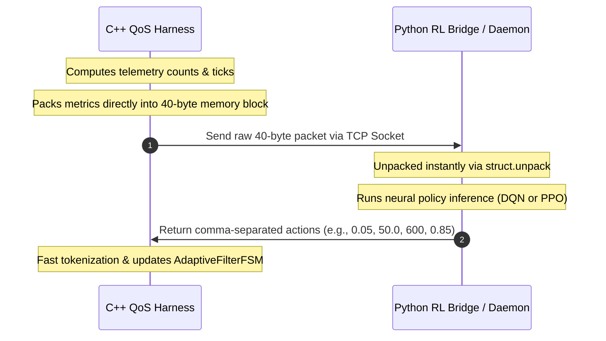
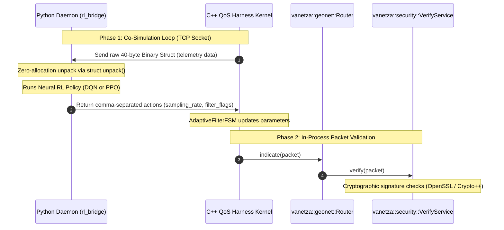
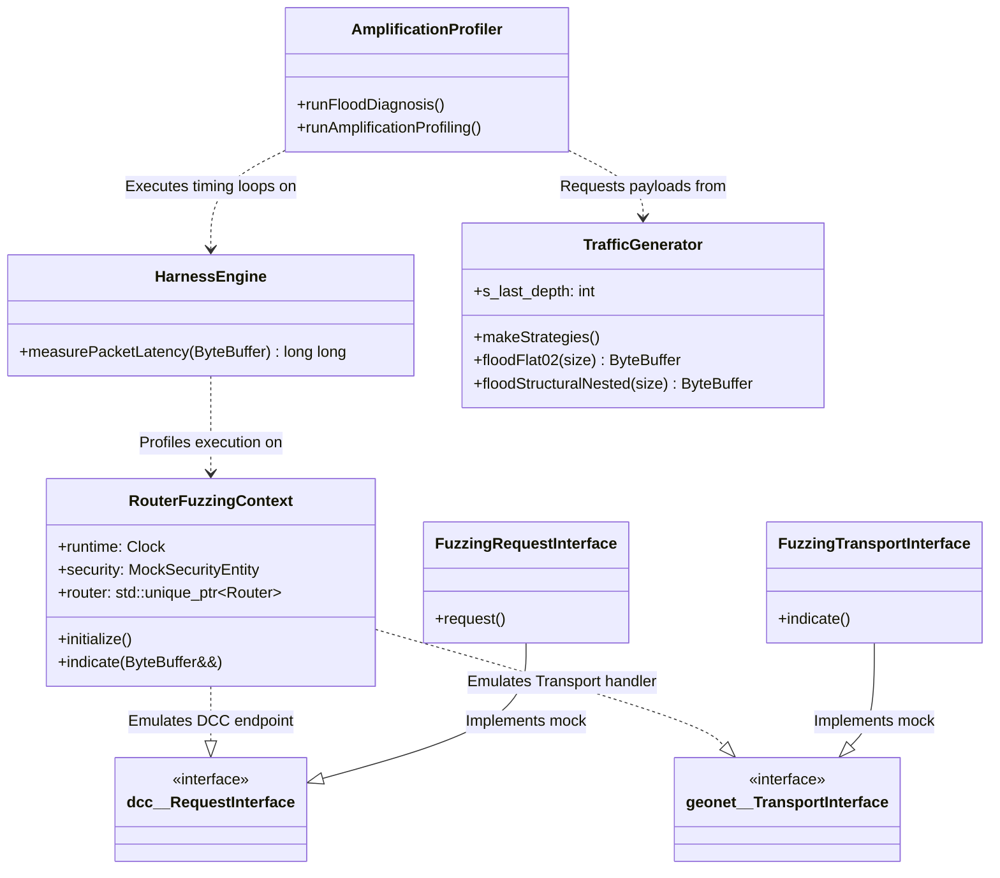
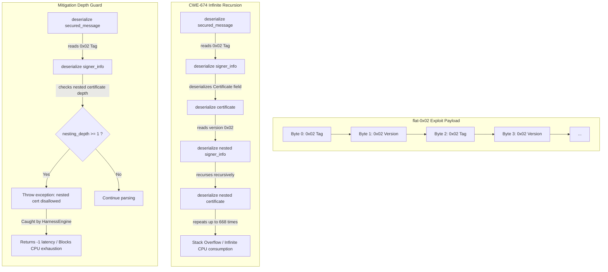

# V2X QoS Harness: C++ Evaluation Kernel

This directory houses the C++ benchmarking evaluation kernel for the V2X ratio-control research project. It simulates live ITS G5 station queues, handles ASN.1 mutated packet parsing, and coordinates mitigation thresholds using either Python socket server endpoints or in-process ONNX Runtime neural inference.

---

## Architectural Overview and Low-Overhead IPC

A major engineering focus was minimizing latency and overhead during interactive Python-C++ co-simulation. Standard serialization formats (like JSON) introduce severe text encoding/decoding latency and frequent memory allocations, which distort simulation timing. 

To resolve this, we implemented a Zero-Allocation Binary Struct Wire Protocol:



### The 40-Byte Telemetry Payload Alignment

Telemetry is packed into a fixed-size C-struct (`<IIIIIQQf` format) of exactly 40 bytes:

| Offset (Bytes) | Field Name | Data Type | Size (Bytes) | Description |
| :--- | :--- | :--- | :--- | :--- |
| **0 - 3** | `tp_count` | `uint32_t` | 4 | True Positives (Detected malware packets) |
| **4 - 7** | `tn_count` | `uint32_t` | 4 | True Negatives (Passed normal packets) |
| **8 - 11** | `fp_count` | `uint32_t` | 4 | False Positives (Incorrectly blocked benign) |
| **12 - 15** | `fn_count` | `uint32_t` | 4 | False Negatives (Leaked malware packets) |
| **16 - 19** | `inspected_count` | `uint32_t` | 4 | Total number of packets inspected |
| **20 - 27** | `total_sq` | `uint64_t` | 8 | Accumulated Sum of Squares (Queue feature) |
| **28 - 35** | `total_latency_ticks` | `uint64_t` | 8 | Total CPU clock cycles spent in inspection |
| **36 - 39** | `instant_sampling_rate` | `float` | 4 | Current C++ FSM gate sampling rate |

This guarantees zero string allocations on serialization, fits within a single TCP packet payload (bypassing Nagle's algorithm delay if combined with TCP_NODELAY), and can be unpacked instantly in Python with zero parsing overhead.

---

## Command-Line Arguments

The compiled executable `qos-harness` supports the following parameter switches:

```text
Usage: qos-harness [options]
Options:
  -h               Print help information and exit
  --build-dataset  Collect and dump raw features to outputs/csv_raw/
  --profile-amp    Run mathematical amplification profiling
  --diagnose-flood Run static diagnostics on mutated ASN.1 structures
  --rl             Enable collaborative DRL training mode (connects to socket)
  --onnx <path>    Load ONNX model for in-process local inference deployment
  --disable-safety Disable safe recovery FSM boundary clamps (Dangerous)
  -f               Manually enable C++ FSM mitigation filter
  -t <int>         Total simulation packet count (default: 1,000,000)
  -p <float>       Malicious packet pollution rate (e.g. 5.0 for 5%)
  -m <int>         Simulation attack scenario mode (0, 1, 2, or 3)
```

---

## Console Telemetry UI Layout

The real-time status output utilizes standard ASCII box borders. To prevent line stretching in consoles, follow these exact column padding rules:
* **Diagnosis & Profiler Boxes**: Inner width must be 62 characters (total width: 64 including borders).
* **Telemetry Complete & Summary Boxes**: Inner width must be 81 characters (total width: 83 including borders).

---

---

## CWE-674 Profiling & Mitigation Architecture

To evaluate the CWE-674 Workload Amplification vulnerability (recursive certificate parsing) and verify the patch, we updated the C++ benchmarking kernel with a reproducible, noise-resilient profiling architecture. Below is the multi-layered design mapping.

### Layer 1: Co-Simulation & IPC Architecture (System Level)

This layer manages the interactive Python-C++ co-simulation. We use a **Zero-Allocation Binary Struct Wire Protocol** over TCP socket connections. This bypasses text serialization overhead (like JSON/XML), ensuring that IPC latency does not distort experimental timing.



---

### Layer 2: Subsystem Relationships & Interface Design (Component Level)

To maintain the **Separation of Concerns (SoC)** principle, all evaluation, fuzzed packet generation, and latency measuring logic are decoupled into helper modules, leaving the baseline core `vanetza` stack untouched:



- **`RouterFuzzingContext`**: Implements mock DCC and transport interfaces (`FuzzingRequestInterface`/`FuzzingTransportInterface`) to sandbox the protocol stack, allowing wireless-free packet processing.
- **`HarnessEngine`**: Runs timing benchmarks on packet operations using high-resolution nanosecond clock offsets and catches hardware/software exception faults.
- **`TrafficGenerator`**: Coordinates the payload building strategies, managing the nested certificate chain serialization.
- **`AmplificationProfiler`**: The benchmark orchestrator that sweeps sizes, executes tests, and dumps statistics.

---

### Layer 3: CWE-674 Parsing Loop Deep-Dive (Vulnerability Level)

This layer demonstrates how the parser interprets the `flat-0x02` (Dense ASN.1) exploit packet under unpatched versus patched libraries:



---

### C++ Code Contribution Details

1. **Deterministic Random Seeds (`main.cpp`)**:
   - Introduced the `--seed <uint32_t>` command-line switch.
   - Triggers `srand(seed)` at startup. This eliminates random packet scheduling variances during simulation, guaranteeing identical runs across co-sim evaluations.
2. **Dense ASN.1 Exploit Calibration (`traffic_generator.cpp`)**:
   - Programmed the `flat-0x02` generator to align exactly with OER tag-version parsing patterns (1 byte for `SignerInfoType::Certificate`, 1 byte for inner `version=2`). 
   - This achieves maximum possible recursion depth density (`depth = flood_size / 2`) within MTU boundaries, ensuring a clean worst-case latency profiling curve.
3. **Exploit Payload Synchronization (`amplification_profiler.cpp`)**:
   - On `unpatched` runs, worst-case binary packets are saved to `outputs/amp_packets/` with metadata filenames (e.g., `_depth144.bin`).
   - On `patched` runs, these exact binary files are loaded and evaluated. This guarantees a scientifically sound comparison under the same exploit binaries.
4. **Noise Self-Correction & Auto-Retry Loop (`amplification_profiler.cpp`)**:
   - Restored runs per packet size to `10000` to maintain robust statistical confidence.
   - Created a dynamic self-correcting logic: if the median latency of the current size step is faster than the previous size step (indicating OS task scheduling jitter), the harness throws out the results and automatically retries the 10000-run sweep (up to 3 times) to filter out the noise.
   - Added `recursion_depth` as the final column of the exported `amplification_profile.csv` telemetry.

---

## Unit Testing

We implement a decoupled testing harness under the `tests/` directory to validate layouts without invoking co-simulation logic:
* **Run tests**:
  ```bash
  bash manage_build.sh unpatched test
  ```
  *(Satisfies Separation of Concerns - SoC: executing tests does not trigger a recompile)*.
