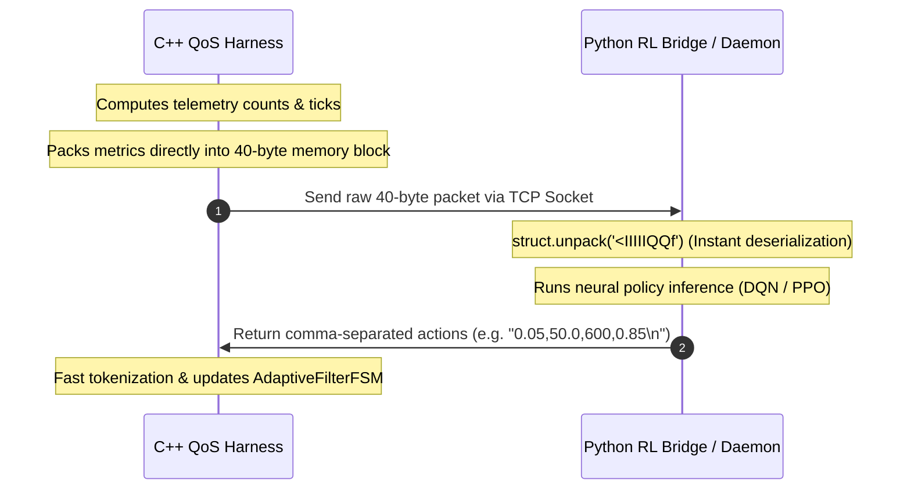

# V2X QoS Harness: C++ Evaluation Kernel

This directory houses the C++ benchmarking evaluation kernel for the V2X ratio-control research project. It simulates live ITS G5 station queues, handles ASN.1 mutated packet parsing, and coordinates mitigation thresholds using either Python socket server endpoints or in-process ONNX Runtime neural inference.

---

## Architectural Overview and Low-Overhead IPC

A major engineering focus was minimizing latency and overhead during interactive Python-C++ co-simulation. Standard serialization formats (like JSON) introduce severe text encoding/decoding latency and frequent memory allocations, which distort simulation timing. 

To resolve this, we implemented a Zero-Allocation Binary Struct Wire Protocol:



### The 40-Byte Telemetry Payload Alignment

Telemetry is packed into a fixed-size C-struct (`<IIIIIQQf` format) of exactly 40 bytes:

| Offset (Bytes) | Field Name | Data Type | Size (Bytes) | Description |
| :--- | :--- | :--- | :--- | :--- |
| **0 - 3** | `tp_count` | `uint32_t` | 4 | True Positives (Detected malware packets) |
| **4 - 7** | `tn_count` | `uint32_t` | 4 | True Negatives (Passed normal packets) |
| **8 - 11** | `fp_count` | `uint32_t` | 4 | False Positives (Incorrectly blocked benign) |
| **12 - 15** | `fn_count` | `uint32_t` | 4 | False Negatives (Leaked malware packets) |
| **16 - 19** | `inspected_count` | `uint32_t` | 4 | Total number of packets inspected |
| **20 - 27** | `total_sq` | `uint64_t` | 8 | Accumulated Sum of Squares (Queue feature) |
| **28 - 35** | `total_latency_ticks` | `uint64_t` | 8 | Total CPU clock cycles spent in inspection |
| **36 - 39** | `instant_sampling_rate` | `float` | 4 | Current C++ FSM gate sampling rate |

This guarantees zero string allocations on serialization, fits within a single TCP packet payload (bypassing Nagle's algorithm delay if combined with TCP_NODELAY), and can be unpacked instantly in Python with zero parsing overhead.

---

## Command-Line Arguments

The compiled executable `qos-harness` supports the following parameter switches:

```text
Usage: qos-harness [options]
Options:
  -h               Print help information and exit
  --build-dataset  Collect and dump raw features to outputs/csv_raw/
  --profile-amp    Run mathematical amplification profiling
  --diagnose-flood Run static diagnostics on mutated ASN.1 structures
  --rl             Enable collaborative DRL training mode (connects to socket)
  --onnx <path>    Load ONNX model for in-process local inference deployment
  --disable-safety Disable safe recovery FSM boundary clamps (Dangerous)
  -f               Manually enable C++ FSM mitigation filter
  -t <int>         Total simulation packet count (default: 1,000,000)
  -p <float>       Malicious packet pollution rate (e.g. 5.0 for 5%)
  -m <int>         Simulation attack scenario mode (0, 1, 2, or 3)
```

---

## Console Telemetry UI Layout

The real-time status output utilizes standard ASCII box borders. To prevent line stretching in consoles, follow these exact column padding rules:
* **Diagnosis & Profiler Boxes**: Inner width must be 62 characters (total width: 64 including borders).
* **Telemetry Complete & Summary Boxes**: Inner width must be 81 characters (total width: 83 including borders).

---

## Unit Testing

We implement a decoupled testing harness under the `tests/` directory to validate layouts without invoking co-simulation logic:
* **Run tests**:
  ```bash
  bash manage_build.sh unpatched test
  ```
  *(Satisfies Separation of Concerns - SoC: executing tests does not trigger a recompile)*.
